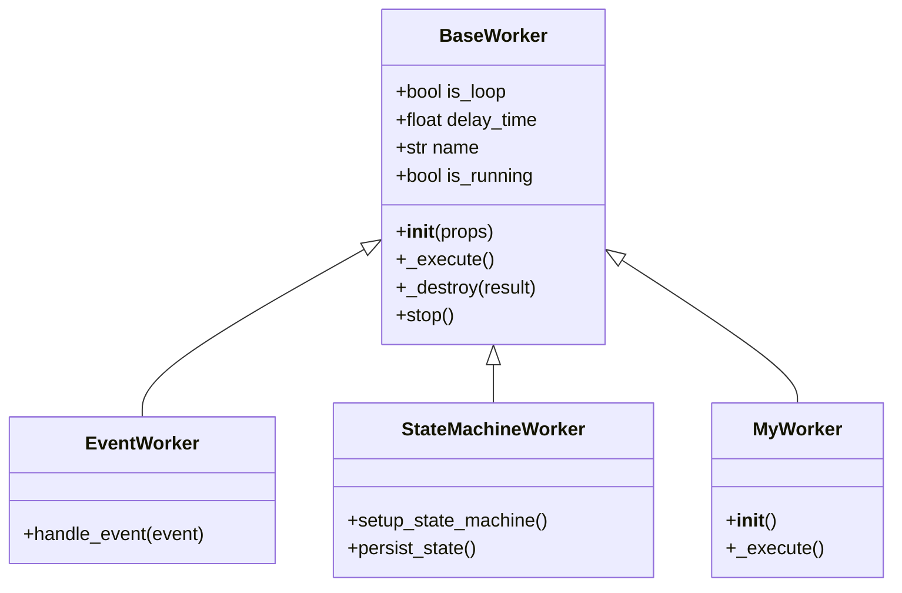
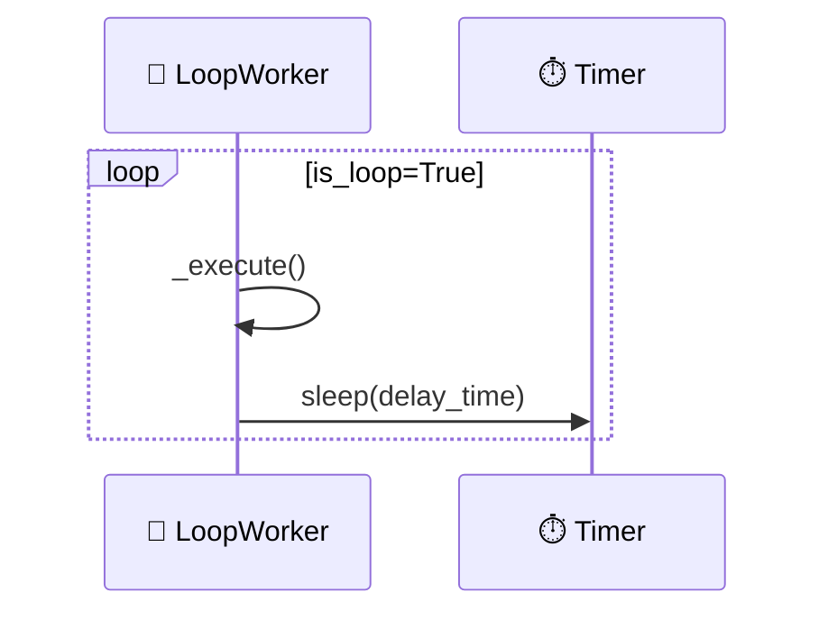
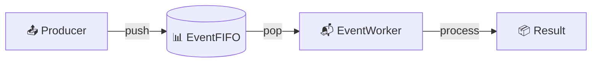
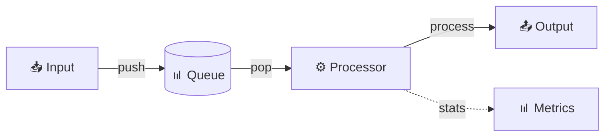
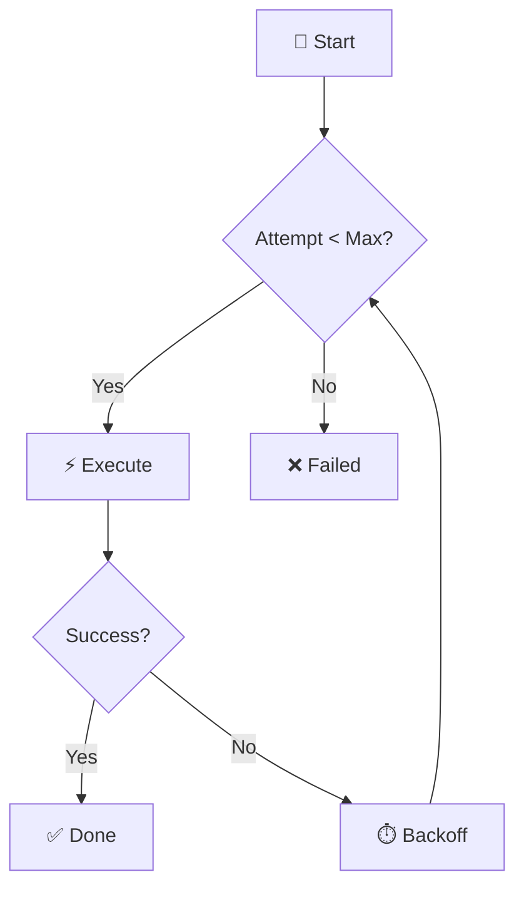
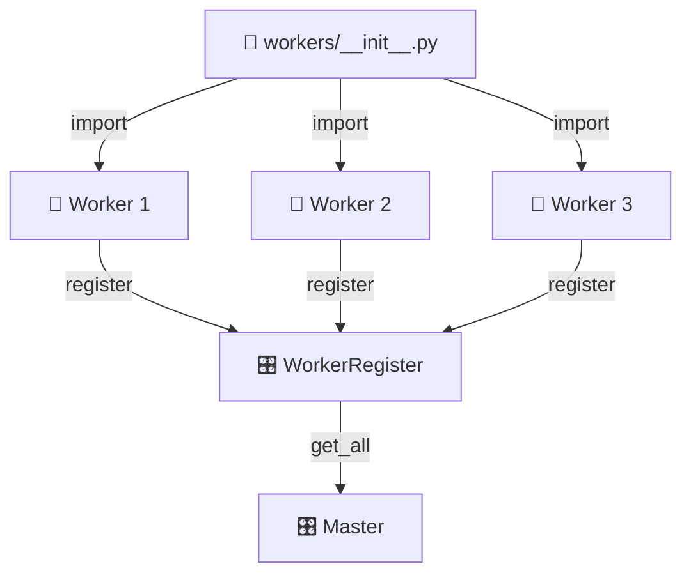
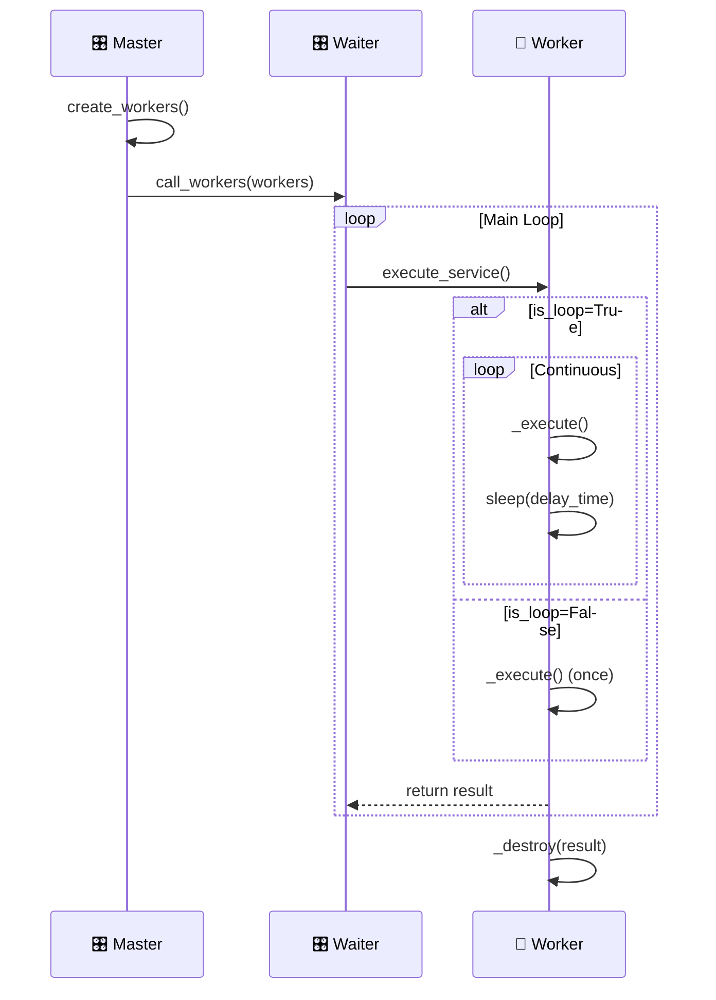

# 👷 Worker 工作器

Worker 是 Zoo Framework 的核心概念，代表一个可执行的逻辑单元。

## 🎯 基本概念

Worker 类似于线程，但提供了更高级的生命周期管理：

| ✨ 特性 | 📝 说明 |
|---------|---------|
| 🔄 自动调度 | 由 Waiter 统一管理执行 |
| 🔄 生命周期回调 | 支持初始化、执行、销毁等阶段 |
| 📊 状态管理 | 内置运行状态跟踪 |
| 📦 结果收集 | 支持执行结果返回 |

## 🏗️ Worker 类层次



## 📋 BaseWorker

所有 Worker 都继承自 `BaseWorker`。

### 📊 属性

| 🏷️ 属性 | 📋 类型 | 📝 说明 |
|---------|---------|---------|
| `is_loop` | ✅ bool | 是否循环执行 |
| `delay_time` | ⏱️ float | 执行间隔（秒）|
| `name` | 🏷️ str | Worker 名称 |
| `is_running` | 🔄 bool | 是否正在运行 |
| `props` | 📦 WorkerProps | Worker 属性对象 |

### 🔧 方法

#### `__init__(props)` - 初始化

```python
from zoo_framework.workers import BaseWorker

class MyWorker(BaseWorker):
    def __init__(self):
        super().__init__({
            "is_loop": True,      # 🔄 循环执行
            "delay_time": 1.0,    # ⏱️ 每秒执行一次
            "name": "MyWorker"    # 🏷️ Worker 名称
        })
```

#### `_execute()` - 执行业务逻辑（⚡ 必须实现）

```python
def _execute(self):
    # ⚡ 在这里编写业务逻辑
    print("✨ 执行业务逻辑")
```

#### `_destroy(result)` - 销毁回调

```python
def _destroy(self, result):
    # 🗑️ Worker 停止时调用
    print(f"👋 Worker stopped: {result}")
```

#### `stop()` - 停止 Worker

```python
worker.stop()  # 🛑 停止 Worker
```

## 🎭 Worker 类型

### 1️⃣ 循环 Worker

持续执行的 Worker：

```python
class LoopWorker(BaseWorker):
    """
    🔄 循环 Worker - 持续执行任务
    """
    def __init__(self):
        super().__init__({
            "is_loop": True,       # 🔄 循环执行
            "delay_time": 5,       # ⏱️ 每 5 秒执行一次
            "name": "LoopWorker"   # 🏷️ 名称
        })
    
    def _execute(self):
        # ⚡ 定期任务
        print("⏰ 执行定期任务")
```



### 2️⃣ 单次 Worker

只执行一次的 Worker：

```python
class OneTimeWorker(BaseWorker):
    """
    ▶️ 单次 Worker - 只执行一次
    """
    def __init__(self):
        super().__init__({
            "is_loop": False,        # 🔴 只执行一次
            "name": "OneTimeWorker"  # 🏷️ 名称
        })
    
    def _execute(self):
        # ⚡ 初始化任务
        print("🚀 执行初始化")
```

### 3️⃣ 事件驱动 Worker

响应事件的 Worker：

```python
from zoo_framework.workers import EventWorker
from zoo_framework.event import EventChannelManager

class MyEventWorker(EventWorker):
    """
    📬 事件驱动 Worker
    """
    def __init__(self):
        super().__init__()
        self.channel = EventChannelManager.get_channel("events")
    
    def _execute(self):
        # 📥 获取事件
        event = self.channel.pop()
        if event:
            self.handle_event(event)
    
    def handle_event(self, event):
        """
        📬 处理事件
        """
        print(f"📨 处理事件: {event.topic}")
```



### 4️⃣ 状态机 Worker

管理状态机的 Worker：

```python
from zoo_framework.workers import StateMachineWorker
from zoo_framework.statemachine import StateMachineManager

class MyStateWorker(StateMachineWorker):
    """
    🔄 状态机 Worker
    """
    def __init__(self):
        super().__init__()
        self.setup_machine()
    
    def setup_machine(self):
        sm = StateMachineManager()
        sm.create_state_machine("my_machine")
        sm.add_state("my_machine", "idle")
        sm.add_state("my_machine", "running")
```

## 💡 完整示例

### ⏰ 定时任务 Worker

```python
from zoo_framework.workers import BaseWorker
from zoo_framework.utils import LogUtils
import datetime


class ScheduledTaskWorker(BaseWorker):
    """
    📅 定时任务 Worker
    每天凌晨执行任务
    """
    
    def __init__(self):
        super().__init__({
            "is_loop": True,
            "delay_time": 60,  # ⏱️ 每分钟检查一次
            "name": "ScheduledTaskWorker"
        })
        self.last_run_date = None
    
    def _execute(self):
        now = datetime.datetime.now()
        
        # 🕛 每天凌晨 0:00 执行
        if now.hour == 0 and now.minute == 0:
            if self.last_run_date != now.date():
                self.run_daily_task()
                self.last_run_date = now.date()
    
    def run_daily_task(self):
        """
        📋 每日任务
        """
        LogUtils.info("🌅 执行每日任务")
        # 🧹 清理日志
        # 📊 生成报表
        # 💾 备份数据
```

### 📊 数据处理 Worker

```python
from zoo_framework.workers import BaseWorker
from zoo_framework.fifo import EventFIFO


class DataProcessorWorker(BaseWorker):
    """
    ⚙️ 数据处理 Worker
    """
    
    def __init__(self):
        super().__init__({
            "is_loop": True,
            "delay_time": 0.1,  # ⚡ 快速处理
            "name": "DataProcessorWorker"
        })
        self.input_queue = EventFIFO()
        self.processed_count = 0
    
    def _execute(self):
        # 📥 从队列获取数据
        node = self.input_queue.pop()
        
        if node:
            result = self.process(node.content)
            self.save_result(result)
            self.processed_count += 1
    
    def process(self, data):
        """
        ⚙️ 处理数据
        """
        return data.upper()
    
    def save_result(self, result):
        """
        💾 保存结果
        """
        pass
```



### 🔄 带重试机制的 Worker

```python
from zoo_framework.workers import BaseWorker
from zoo_framework.utils import LogUtils
import time


class RetryableWorker(BaseWorker):
    """
    🔄 带重试机制的 Worker
    """
    
    def __init__(self):
        super().__init__({
            "is_loop": True,
            "delay_time": 5,
            "name": "RetryableWorker"
        })
        self.max_retries = 3
    
    def _execute(self):
        for attempt in range(self.max_retries):
            try:
                self.do_work()
                break  # ✅ 成功则退出重试
            except Exception as e:
                LogUtils.warning(f"🔄 重试 {attempt + 1}/{self.max_retries}: {e}")
                if attempt < self.max_retries - 1:
                    time.sleep(2 ** attempt)  # 📈 指数退避
                else:
                    LogUtils.error("❌ 所有重试失败")
    
    def do_work(self):
        """
        ⚡ 可能失败的操作
        """
        pass
```



## 📝 Worker 注册

Worker 需要在 `workers/__init__.py` 中导入才能被自动注册：

```python
# workers/__init__.py
from .scheduled_task_worker import ScheduledTaskWorker
from .data_processor_worker import DataProcessorWorker
from .retryable_worker import RetryableWorker
```



## ✅ 最佳实践

### 1️⃣ 合理设置 delay_time

| 📝 任务类型 | ⏱️ delay_time | 📝 说明 |
|-------------|---------------|---------|
| ⚡ 高频任务 | 0.01-0.1s | 实时数据处理 |
| 🔄 中频任务 | 1-5s | 定时检查 |
| 📅 低频任务 | 60+s | 报表生成 |

### 2️⃣ 异常处理

```python
def _execute(self):
    try:
        # ⚡ 业务逻辑
        pass
    except Exception as e:
        LogUtils.error(f"❌ Worker error: {e}")
        # 🛑 可选：停止 Worker
        # self.stop()
```

### 3️⃣ 资源清理

```python
def _destroy(self, result):
    """
    🗑️ 资源清理
    """
    # 🔒 关闭数据库连接
    # 📁 释放文件句柄
    # 🧹 清理临时数据
    LogUtils.info(f"👋 Worker {self.name} destroyed")
```

### 4️⃣ 状态监控

```python
def _execute(self):
    import time
    start_time = time.time()
    
    # ⚡ 执行业务逻辑
    
    duration = time.time() - start_time
    LogUtils.debug(f"⏱️ Worker {self.name} executed in {duration:.3f}s")
```

## 📊 Worker 执行流程


