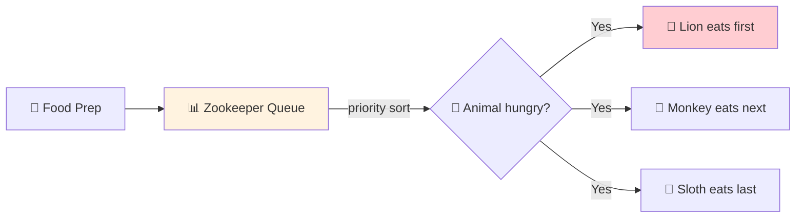
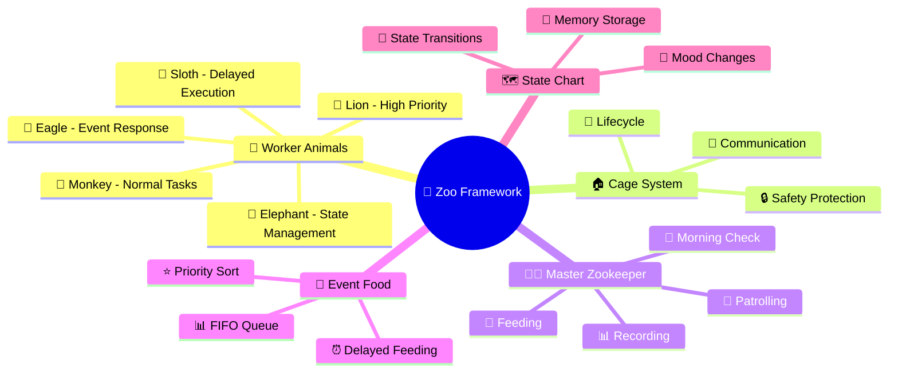

## 🎪 The Zoo Concept

> **Zoo Framework** is inspired by real zoo management systems:

```mermaid
graph TB
    subgraph 🎪 Zoo Framework
        M[👨‍💼 Master Zookeeper<br/>Overall Management]
        
        subgraph 🏠 Cage Area
            C1[🦁 Lion Cage<br/>High Priority Worker]
            C2[🐒 Monkey Cage<br/>Normal Worker]
            C3[🦥 Sloth Cage<br/>Delayed Worker]
        end
        
        subgraph 🍖 Cafeteria FIFO
            F[📊 Zookeeper Queue<br/>Priority Distribution]
        end
        
        subgraph 🗺️ State Center
            S[🗺️ Animal States<br/>StateMachine]
        end
    end
    
    M -->|manage| C1
    M -->|manage| C2
    M -->|manage| C3
    F -->|feed| C1
    F -->|feed| C2
    F -->|feed| C3
    C1 -->|update| S
    C2 -->|update| S
    C3 -->|update| S
```

### 🦁 Worker = Animal

Each **Worker** is a unique animal in the zoo:

| 🦁 Animal | 📝 Worker Type | ⚡ Characteristics |
|---------|---------------|---------|
| 🦁 Lion | High Priority Worker | Fierce, gets resources first |
| 🐒 Monkey | Normal Worker | Flexible, active, loops execution |
| 🦥 Sloth | Delayed Worker | Slow, scheduled execution |
| 🦅 Eagle | Event Worker | Sharp, responds to events |
| 🐘 Elephant | State Machine Worker | Steady, manages complex states |

```python
# 🦁 Create a Lion Worker (high priority)
from zoo_framework.workers import BaseWorker

class LionWorker(BaseWorker):  # 🦁 Lion
    def __init__(self):
        super().__init__({
            "name": "🦁 LionKing",      # Lion King
            "delay_time": 1,             # Patrol every second
            "priority": 100              # 🔴 Highest priority
        })
    
    def _execute(self):
        print("🦁 Roar! I'm the king, handling important tasks first!")
```

### 🏠 Cage = Home

**Cage** is the home for animals:

- 🔒 **Safety Protection** - Prevents animals from running wild (thread safety)
- 🔄 **Schedule Management** - Manages animal routines (lifecycle)
- 📢 **Communication System** - Inter-cage messaging (event communication)
- 📊 **Health Monitoring** - Tracks animal health status (monitoring)

```python
from zoo_framework.core.aop import Cage

@cage.protect  # 🏠 Put Worker in protected cage
class ProtectedWorker(BaseWorker):
    """
    🐒 Protected Monkey Worker
    Runs safely in the Cage
    """
    def _execute(self):
        print("🐒 I'm playing safely in my cage!")
```

### 🎪 Master = Zookeeper

**Master** is the zookeeper:

```
👨‍💼 A Day in the Life of Master:
├── 🌅 Morning - Check all animal (Worker) status
├── 🍖 Morning - Distribute food (Events) to hungry animals
├── 🔄 Afternoon - Patrol cages (Cages), ensure smooth operation
├── 📊 Evening - Record animal states (StateMachine)
└── 🌙 Night - Save data, rest
```

```python
from zoo_framework.core import Master

# 👨‍💼 Create the zookeeper
master = Master()

# 🎪 Open the zoo! All animals start working
master.run()
```

### 🍖 Event = Food

**Event** is food for animals:



```python
from zoo_framework.fifo.node import EventNode

# 🍖 Prepare food (event)
food = EventNode(
    topic="lunch.meat",           # 🥩 Lunch meat
    content={"type": "beef"},      # Beef
    priority=100                   # 🔴 High priority food
)

# 📤 Put in zookeeper queue
EventChannelManager.get_channel("zoo").push(food)
```

## 🚀 Quick Start

### 🎫 Get Ticket (Install)

::: code-group

```bash [pip]
pip install zoo-framework
```

```bash [uv]
uv pip install zoo-framework
```

:::

### 🏗️ Build Your Zoo (Create Project)

```bash
# 🏗️ Create your zoo
zfc --create my_zoo
cd my_zoo

# 🦁 Add animals
zfc --worker lion
zfc --worker monkey
zfc --worker sloth
```

### 🦁 Raise a Lion

```python
# workers/lion_worker.py
from zoo_framework.workers import BaseWorker

class LionWorker(BaseWorker):  # 🦁 Lion
    def __init__(self):
        super().__init__({
            "name": "🦁 LionKing",
            "is_loop": True,
            "delay_time": 2  # ⏱️ Patrol every 2 seconds
        })
    
    def _execute(self):
        print("🦁 Roar! I'm the Lion King, handling high priority tasks!")
```

### 🎪 Open the Zoo

```python
# main.py
from zoo_framework.core import Master

if __name__ == "__main__":
    print("🎪 Zoo is opening!")
    master = Master()
    master.run()  # 🎉 All animals start working
```

Output:
```
🎪 Zoo is opening!
🦁 Roar! I'm the Lion King, handling high priority tasks!
🦁 Roar! I'm the Lion King, handling high priority tasks!
```

## 🗺️ Zoo Map



## 📚 Guide

### 🔰 Getting Started
- [🎫 Quick Start](/en/start/) - Become a zookeeper in 5 minutes
- [🏗️ Build Your Zoo](/en/start/new.html) - Create your first zoo
- [🗺️ Zoo Layout](/en/guide/structure.html) - Understand zoo structure

### 🦁 Meet the Animals
- [🦁 Worker Animals](/en/core/worker.html) - Learn about different animals
- [🍖 Event Food System](/en/core/event.html) - How to feed animals
- [🗺️ State Charts](/en/core/statemachine.html) - Animal mood changes
- [📊 FIFO Zookeeper](/en/core/fifo.html) - Food distribution
- [🏠 Cage](/en/core/cage.html) - Animal homes

### 🎪 Advanced Training
- [✂️ AOP Training](/en/advanced/aop.html)
- [⚡ Reactor Training](/en/advanced/reactor.html)
- [🔒 Cage Security](/en/advanced/lock.html)
- [🔌 New Species](/en/advanced/plugin.html)

## 🌟 Why Zoo Framework?

### 🎪 Fun Programming Experience

Traditional threading: Boring Thread management  
**Zoo Framework**: Fun zoo management! 🎪

```python
# ❌ Traditional: boring
import threading
t = threading.Thread(target=func)
t.start()

# ✅ Zoo Framework: fun!
class LionWorker(BaseWorker):  # 🦁 I'm a lion!
    def _execute(self):
        print("Roar!")
```

### 🧠 Easy to Understand

| 🎪 Zoo Concept | 💻 Programming Concept |
|--------------|------------|
| 🦁 Animal | Worker |
| 🏠 Cage | Cage Thread Management |
| 👨‍💼 Zookeeper | Master Scheduler |
| 🍖 Food | Event |
| 📊 Zookeeper | FIFO Queue |
| 🗺️ State Chart | StateMachine |

### 🛡️ Safe and Reliable

- 🔒 Cage protects thread safety
- 👨‍💼 Master monitors everything
- 📊 Comprehensive logging and monitoring

## 🤝 Become a Zookeeper

Welcome to join the Zoo Framework community!

[GitHub](https://github.com/YearsAlso/zoo-framework) | [Issues](https://github.com/YearsAlso/zoo-framework/issues) | [Docs](https://github.com/YearsAlso/zoo-framework-doc)

---

<p align="center">
  🎪 Made with ❤️ by Zoo Framework Team 🦁
</p>
