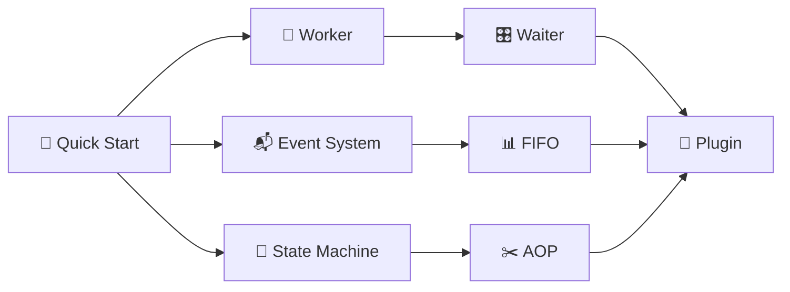

# 🎪 Quick Start

## 📦 Installation

### Using pip

::: code-group

```bash [Recommended]
pip install zoo-framework
```

```bash [Development]
pip install -e git+https://github.com/YearsAlso/zoo-framework.git#egg=zoo-framework
```

:::

### Install from Source

```bash
git clone https://github.com/YearsAlso/zoo-framework.git
cd zoo-framework
pip install -e .
```

## 🎯 Create Your First Project

### 1️⃣ Create Project with CLI

```bash
zfc --create my_first_project
cd my_first_project
```

This creates the following structure:

```
my_first_project/
├── 📄 config.json          # Configuration
├── 📁 src/                 # Source code
│   ├── 🚀 main.py         # Entry point
│   ├── 👷 workers/        # Workers
│   │   └── __init__.py
│   ├── 📬 events/         # Events
│   │   └── __init__.py
│   ├── ⚙️ conf/           # Config
│   │   └── __init__.py
│   └── 📋 params/         # Parameters
│       └── __init__.py
└── 📁 logs/               # Logs
```

### 📄 config.json

```json
{
  "_exports": [],
  "📝 log": {
    "📁 path": "./logs",
    "📊 level": "debug"
  },
  "👷 worker": {
    "🎛️ runPolicy": "simple",
    "🏊 pool": {
      "🔢 size": 5,
      "✅ enabled": false
    }
  }
}
```

Configuration options:

| 🔧 Option | 📋 Type | 📝 Description | 🔢 Default |
|-----------|---------|----------------|------------|
| `log.path` | 📁 string | Log file path | `./logs` |
| `log.level` | 📊 string | Log level | `info` |
| `worker.runPolicy` | 🎛️ string | Worker policy | `simple` |
| `worker.pool.enabled` | ✅ boolean | Enable thread pool | `false` |
| `worker.pool.size` | 🔢 integer | Pool size | `5` |

## 👷 Create a Worker

```bash
zfc --worker hello
```

This creates `src/workers/hello_worker.py`:

```python
from zoo_framework.workers.base_worker import BaseWorker


class HelloWorker(BaseWorker):
    def __init__(self):
        BaseWorker.__init__(self, {
            "is_loop": True,
            "delay_time": 5,
            "name": "HelloWorker"
        })

    def _destroy(self, result):
        pass

    def _execute(self):
        # 📝 Write your business logic here
        pass
```

And registers it in `src/workers/__init__.py`:

```python
from .hello_worker import HelloWorker
```

## 💻 Write Business Code

Edit `src/workers/hello_worker.py`:

```python
from zoo_framework.workers import BaseWorker
from zoo_framework.utils import LogUtils


class HelloWorker(BaseWorker):
    """
    👋 Welcome Worker - Demo basic functionality
    """
    
    def __init__(self):
        super().__init__({
            "is_loop": True,      # 🔄 Loop execution
            "delay_time": 2,      # ⏱️ Every 2 seconds
            "name": "HelloWorker" # 🏷️ Worker name
        })
        self.counter = 0

    def _destroy(self, result):
        """
        🗑️ Cleanup callback - called when worker stops
        """
        LogUtils.info(f"👋 Worker finished, executed {result} times")

    def _execute(self):
        """
        ⚡ Business logic - must implement
        """
        self.counter += 1
        LogUtils.info(f"✨ Hello Zoo Framework! Count: {self.counter}")
```

## 🚀 Launch Application

Edit `src/main.py`:

```python
from zoo_framework.core import Master

def main():
    """
    🚀 Application entry
    """
    # 🎯 Create Master instance
    master = Master(loop_interval=1)
    
    # ▶️ Run application
    master.run()

if __name__ == "__main__":
    main()
```

Run:

```bash
cd src
python main.py
```

Expected output:

```
[📅 2024-01-15 10:00:00] [INFO] 🚀 Zoo Framework started
[📅 2024-01-15 10:00:00] [INFO] 👷 HelloWorker registered
[📅 2024-01-15 10:00:02] [INFO] ✨ Hello Zoo Framework! Count: 1
[📅 2024-01-15 10:00:04] [INFO] ✨ Hello Zoo Framework! Count: 2
[📅 2024-01-15 10:00:06] [INFO] ✨ Hello Zoo Framework! Count: 3
...
```

## 🏗️ Project Architecture

```mermaid
flowchart TB
    subgraph 🎯 Application
        M[🎛️ Master<br/>Control Center]
    end
    
    subgraph 🔄 Scheduling
        W[🎛️ Waiter<br/>Execution Policy]
    end
    
    subgraph 👷 Workers
        W1[👷 Worker 1<br/>Loop Task]
        W2[👷 Worker 2<br/>Event Driven]
        W3[👷 Worker 3<br/>One-time]
    end
    
    subgraph 📬 Communication
        E[📬 EventChannel<br/>Event Channel]
        F[📊 EventFIFO<br/>Priority Queue]
    end
    
    subgraph 💾 Persistence
        S[🔄 StateMachine<br/>State Management]
        L[📝 LogUtils<br/>Logging]
    end
    
    M --> W
    W --> W1
    W --> W2
    W --> W3
    W1 --> E
    W2 --> F
    W3 --> S
    W1 --> L
    W2 --> L
    W3 --> L
```

## 📚 Core Concepts

### 👷 Worker - The Animal

Workers are the basic execution units:

```python
from zoo_framework.workers import BaseWorker

class MyWorker(BaseWorker):
    def __init__(self):
        super().__init__({
            "is_loop": True,      # 🔄 Loop or not
            "delay_time": 1,      # ⏱️ Execution interval
            "name": "MyWorker"    # 🏷️ Name
        })
    
    def _execute(self):
        # ⚡ Business logic
        pass
```

### 📬 Events

Event-driven mechanism:

```python
from zoo_framework.event import EventChannelManager
from zoo_framework.fifo import EventFIFO
from zoo_framework.fifo.node import EventNode

# 📤 Create event
node = EventNode(
    topic="user.login",
    content={"user_id": 123, "name": "John"},
    priority=10
)

# 📨 Send event
EventChannelManager.get_channel("default").push(node)
```

### 🔄 State Machine

Manage state transitions:

```python
from zoo_framework.statemachine import StateMachineManager

# 🎯 Create state machine
sm = StateMachineManager()
sm.create_state_machine("order")

# ➕ Add states
sm.add_state("order", "created")
sm.add_state("order", "paid")
sm.add_state("order", "shipped")

# 🔄 Transition
sm.transfer("order", "created", "paid")
```

## 🗺️ Learning Path



1. [👷 Deep dive into Worker →](/en/core/worker.html)
2. [📬 Learn Event System →](/en/core/event.html)
3. [🔄 Master State Machine →](/en/core/statemachine.html)
4. [📊 Understand FIFO →](/en/core/fifo.html)

## ❓ FAQ

### Q: Worker not executing?

A: Ensure Worker is imported in `workers/__init__.py`:

```python
from .hello_worker import HelloWorker
```

### Q: How to debug?

A: Set log level to debug:

```json
{
  "log": {
    "level": "debug"
  }
}
```

### Q: How to stop Worker?

A: Set `is_loop = False`:

```python
def __init__(self):
    super().__init__({
        "is_loop": False,  # 🔴 Execute once
        "name": "OneTimeWorker"
    })
```

## 🎉 Congratulations!

You've completed your first Zoo Framework project! 🎊

Continue exploring:
- [📖 Core Concepts](/en/core/worker.html)
- [🔧 Advanced Features](/en/advanced/aop.html)
- [📚 API Reference](/en/api/core.html)
