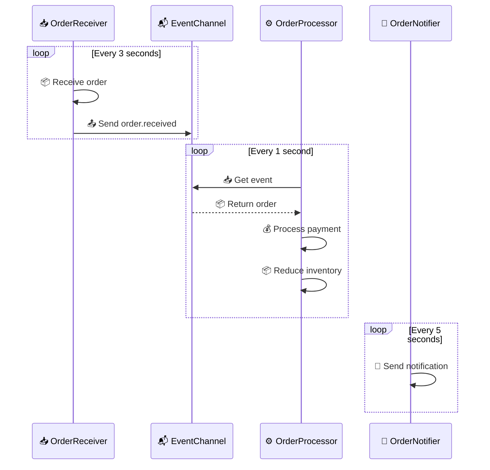

# 🆕 Create New Project

## 🛠️ Using zfc CLI Tool

Zoo Framework provides the `zfc` command-line tool for quick project scaffolding.

## 📁 Create Project

```bash
zfc --create <project_name>
```

Example:

```bash
zfc --create ecommerce_system
```

## 🗂️ Project Structure

After creation, the project structure looks like:

```
ecommerce_system/
├── 📄 config.json              # 🔧 Main configuration
├── 📁 src/                     # 💻 Source code
│   ├── 🚀 main.py             # 🎯 Application entry
│   ├── 👷 workers/            # 👷 Worker directory
│   │   ├── __init__.py
│   │   └── *.py
│   ├── 📬 events/             # 📬 Event definitions
│   │   ├── __init__.py
│   │   └── *.py
│   ├── ⚙️ conf/               # ⚙️ Configuration classes
│   │   ├── __init__.py
│   │   └── *.py
│   └── 📋 params/             # 📋 Parameter classes
│       ├── __init__.py
│       └── *.py
└── 📁 logs/                   # 📝 Log directory
```

### 📄 config.json

```json
{
  "_exports": [],
  "📝 log": {
    "📁 path": "./logs",
    "📊 level": "debug"
  },
  "👷 worker": {
    "🎛️ runPolicy": "simple",
    "🏊 pool": {
      "🔢 size": 5,
      "✅ enabled": false
    }
  }
}
```

Configuration options:

| 🔧 Option | 📋 Type | 📝 Description | 🔢 Default |
|-----------|---------|----------------|------------|
| `log.path` | 📁 string | Log file path | `./logs` |
| `log.level` | 📊 string | Log level | `info` |
| `worker.runPolicy` | 🎛️ string | Worker policy | `simple` |
| `worker.pool.enabled` | ✅ boolean | Enable thread pool | `false` |
| `worker.pool.size` | 🔢 integer | Pool size | `5` |

## 👷 Create Worker

```bash
zfc --worker <worker_name>
```

Example:

```bash
zfc --worker order_processor
```

This creates `src/workers/order_processor_worker.py`:

```python
from zoo_framework.workers.base_worker import BaseWorker


class OrderProcessorWorker(BaseWorker):
    def __init__(self):
        BaseWorker.__init__(self, {
            "is_loop": True,
            "delay_time": 5,
            "name": "OrderProcessorWorker"
        })

    def _destroy(self, result):
        pass

    def _execute(self):
        # 📝 Write business logic
        pass
```

And registers in `src/workers/__init__.py`:

```python
from .order_processor_worker import OrderProcessorWorker
```

## 📊 Project Architecture Diagram

```mermaid
graph TB
    subgraph 📁 Project Root
        C[📄 config.json]
    end
    
    subgraph 📁 src/
        M[🚀 main.py]
        
        subgraph 👷 workers/
            W1[order_worker.py]
            W2[payment_worker.py]
            WI[__init__.py]
        end
        
        subgraph 📬 events/
            E1[event_definitions.py]
            EI[__init__.py]
        end
        
        subgraph ⚙️ conf/
            CF1[app_config.py]
            CFI[__init__.py]
        end
        
        subgraph 📋 params/
            P1[worker_params.py]
            PI[__init__.py]
        end
    end
    
    subgraph 📁 logs/
        L1[app.log]
    end
    
    C --> M
    M --> W1
    M --> W2
    WI --> W1
    WI --> W2
    M --> E1
    M --> CF1
    M --> P1
    W1 --> L1
    W2 --> L1
```

## 💼 Complete Example

### 1️⃣ Create Project

```bash
zfc --create order_system
cd order_system
```

### 2️⃣ Create Multiple Workers

```bash
zfc --worker order_receiver
zfc --worker order_processor
zfc --worker order_notifier
```

### 3️⃣ Write Business Code

📄 `src/workers/order_receiver_worker.py`:

```python
from zoo_framework.workers import BaseWorker
from zoo_framework.utils import LogUtils
from zoo_framework.event import EventChannelManager
from zoo_framework.fifo.node import EventNode


class OrderReceiverWorker(BaseWorker):
    """
    📥 Order Receiver Worker - Receives and distributes orders
    """
    
    def __init__(self):
        super().__init__({
            "is_loop": True,
            "delay_time": 3,  # ⏱️ Check every 3 seconds
            "name": "OrderReceiverWorker"
        })
    
    def _execute(self):
        # 📦 Simulate receiving order
        order = {"order_id": f"ORD-{time.time()}", "amount": 199.99}
        LogUtils.info(f"📥 Received order: {order['order_id']}")
        
        # 📤 Send order event
        node = EventNode(
            topic="order.received",
            content=order,
            priority=50
        )
        EventChannelManager.get_channel("order").push(node)
```

📄 `src/workers/order_processor_worker.py`:

```python
from zoo_framework.workers import BaseWorker
from zoo_framework.utils import LogUtils
from zoo_framework.event import EventChannelManager


class OrderProcessorWorker(BaseWorker):
    """
    ⚙️ Order Processor Worker - Processes order business
    """
    
    def __init__(self):
        super().__init__({
            "is_loop": True,
            "delay_time": 1,  # ⏱️ Process every second
            "name": "OrderProcessorWorker"
        })
    
    def _execute(self):
        # 📥 Get order from event channel
        channel = EventChannelManager.get_channel("order")
        node = channel.pop()
        
        if node and node.topic == "order.received":
            LogUtils.info(f"⚙️ Processing order: {node.content['order_id']}")
            # 💰 Deduct payment, reduce inventory...
            self.process_payment(node.content)
```

📄 `src/workers/order_notifier_worker.py`:

```python
from zoo_framework.workers import BaseWorker
from zoo_framework.utils import LogUtils


class OrderNotifierWorker(BaseWorker):
    """
    📧 Order Notifier Worker - Sends order notifications
    """
    
    def __init__(self):
        super().__init__({
            "is_loop": True,
            "delay_time": 5,
            "name": "OrderNotifierWorker"
        })
    
    def _execute(self):
        # 📧 Send email/SMS notification
        LogUtils.info("📧 Sending order notification")
```

### 4️⃣ Configure config.json

```json
{
  "_exports": [],
  "📝 log": {
    "📁 path": "./logs",
    "📊 level": "info"
  },
  "👷 worker": {
    "🎛️ runPolicy": "stable",
    "🏊 pool": {
      "🔢 size": 10,
      "✅ enabled": true
    }
  }
}
```

### 5️⃣ Launch Application

📄 `src/main.py`:

```python
from zoo_framework.core import Master

if __name__ == "__main__":
    # 🎯 Create Master instance
    master = Master()
    
    # 🚀 Launch application
    master.run()
```

Run:

```bash
cd src
python main.py
```

## 🔄 Data Flow Diagram



## 🎯 Configuration Best Practices

### 📝 Log Levels

| 📊 Level | 📝 Use Case |
|----------|-------------|
| `debug` | 🐛 Development debugging |
| `info` | 📋 Production environment |
| `warning` | ⚠️ Warning messages |
| `error` | ❌ Error messages |

### 🎛️ Run Policies

| 🎛️ Policy | 📝 Use Case | ⚡ Characteristics |
|------------|-------------|-------------------|
| `simple` | 🚀 Simple applications | Single-threaded sequential |
| `stable` | 🛡️ Production | Auto recovery from exceptions |
| `safe` | 🔒 High concurrency | Thread isolation |

### 🏊 Thread Pool Configuration

```json
{
  "👷 worker": {
    "🏊 pool": {
      "✅ enabled": true,
      "🔢 size": 10
    }
  }
}
```

- 🔢 `size`: Set based on CPU cores, typically `CPU cores * 2`
- ✅ `enabled`: Recommended for CPU-intensive tasks

## ❓ FAQ

### Q: How to create multiple workers of the same type?

A: Create different classes:

```python
class OrderProcessorWorker1(BaseWorker):
    def __init__(self):
        super().__init__({"name": "OrderProcessor1"})

class OrderProcessorWorker2(BaseWorker):
    def __init__(self):
        super().__init__({"name": "OrderProcessor2"})
```

### Q: How do workers communicate?

A: Use the event system:

```python
# Worker A sends
EventChannelManager.get_channel("channel_name").push(node)

# Worker B receives
node = EventChannelManager.get_channel("channel_name").pop()
```

### Q: How to configure different config files for different environments?

A: Use environment variables:

```python
import os

config_file = os.getenv("ZOO_CONFIG", "config.json")
ParamsFactory(config_file)
```

## 📚 Next Steps

- [👷 Deep dive into Worker →](/en/core/worker.html)
- [📬 Learn Event System →](/en/core/event.html)
- [🔄 Master State Machine →](/en/core/statemachine.html)
