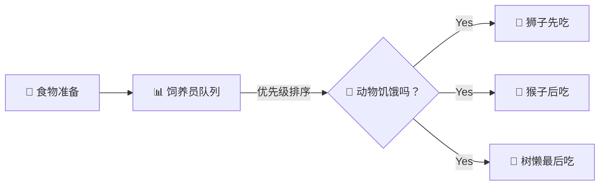

<style>
.zoo-concept {
  margin: 2rem 0;
  padding: 2rem;
  background: linear-gradient(135deg, #f5f7fa 0%, #e4e8ec 100%);
  border-radius: 12px;
}
.zoo-concept h2 {
  text-align: center;
  color: #2c3e50;
  margin-bottom: 1.5rem;
}
.zoo-concept blockquote {
  text-align: center;
  font-size: 1.1rem;
  color: #555;
  border-left: none;
  background: transparent;
}
.concept-grid {
  display: grid;
  grid-template-columns: repeat(auto-fit, minmax(280px, 1fr));
  gap: 1.5rem;
  margin: 2rem 0;
}
.concept-card {
  background: white;
  padding: 1.5rem;
  border-radius: 10px;
  box-shadow: 0 2px 8px rgba(0,0,0,0.1);
  border-left: 4px solid #42b883;
}
.concept-card h3 {
  margin-top: 0;
  color: #2c3e50;
  display: flex;
  align-items: center;
  gap: 0.5rem;
}
.concept-card ul {
  margin: 0;
  padding-left: 1.2rem;
}
.concept-card li {
  margin: 0.5rem 0;
  color: #555;
}
.animal-table {
  width: 100%;
  margin: 1.5rem 0;
  border-collapse: collapse;
}
.animal-table th {
  background: #42b883;
  color: white;
  padding: 0.8rem;
  text-align: left;
}
.animal-table td {
  padding: 0.8rem;
  border-bottom: 1px solid #eee;
}
.animal-table tr:hover {
  background: #f5f5f5;
}
.code-example {
  background: #1e1e1e;
  color: #d4d4d4;
  padding: 1rem;
  border-radius: 8px;
  margin: 1rem 0;
  overflow-x: auto;
}
.quick-start {
  background: linear-gradient(135deg, #667eea 0%, #764ba2 100%);
  color: white;
  padding: 2rem;
  border-radius: 12px;
  margin: 2rem 0;
}
.quick-start h2 {
  color: white;
  text-align: center;
  margin-bottom: 1.5rem;
}
.quick-start-steps {
  display: grid;
  grid-template-columns: repeat(auto-fit, minmax(200px, 1fr));
  gap: 1rem;
}
.step {
  background: rgba(255,255,255,0.1);
  padding: 1rem;
  border-radius: 8px;
  text-align: center;
}
.step-number {
  font-size: 2rem;
  font-weight: bold;
  margin-bottom: 0.5rem;
}
.why-zoo {
  margin: 2rem 0;
}
.why-zoo h2 {
  text-align: center;
  color: #2c3e50;
}
.comparison-table {
  width: 100%;
  margin: 1.5rem 0;
  border-collapse: collapse;
}
.comparison-table th {
  background: #667eea;
  color: white;
  padding: 1rem;
}
.comparison-table td {
  padding: 1rem;
  border-bottom: 1px solid #eee;
  text-align: center;
}
.guide-links {
  display: grid;
  grid-template-columns: repeat(auto-fit, minmax(250px, 1fr));
  gap: 1rem;
  margin: 1.5rem 0;
}
.guide-card {
  background: white;
  padding: 1.2rem;
  border-radius: 8px;
  box-shadow: 0 2px 4px rgba(0,0,0,0.1);
  border-top: 3px solid #42b883;
}
.guide-card h4 {
  margin-top: 0;
  color: #2c3e50;
}
.guide-card ul {
  margin: 0;
  padding-left: 1.2rem;
}
.guide-card a {
  color: #42b883;
  text-decoration: none;
}
.guide-card a:hover {
  text-decoration: underline;
}
</style>

<div class="zoo-concept">

## 🎪 动物园理念

> **Zoo Framework** 的设计理念来自真实的动物园管理系统

```mermaid
graph TB
    subgraph 🎪 Zoo Framework 动物园
        M[👨‍💼 Master 园长<br/>统筹全局]
        
        subgraph 🏠 Cage 笼子区
            C1[🦁 狮子笼<br/>高优先级 Worker]
            C2[🐒 猴子笼<br/>普通 Worker]
            C3[🦥 树懒笼<br/>延迟 Worker]
        end
        
        subgraph 🍖 食堂 FIFO
            F[📊 饲养员队列<br/>优先级分发]
        end
        
        subgraph 🗺️ 状态中心
            S[🗺️ 动物状态图<br/>StateMachine]
        end
    end
    
    M -->|管理| C1
    M -->|管理| C2
    M -->|管理| C3
    F -->|喂食| C1
    F -->|喂食| C2
    F -->|喂食| C3
    C1 -->|更新| S
    C2 -->|更新| S
    C3 -->|更新| S
```

</div>

<div class="concept-grid">

<div class="concept-card">

### 🦁 Worker = 动物

每只 **Worker** 都是动物园里独特的动物：

| 动物 | Worker 类型 | 特点 |
|:---:|:---|:---|
| 🦁 | 高优先级 Worker | 凶猛、优先获得资源 |
| 🐒 | 普通 Worker | 灵活、好动、循环执行 |
| 🦥 | 延迟 Worker | 慢吞吞、定时执行 |
| 🦅 | 事件 Worker | 敏锐、响应事件 |
| 🐘 | 状态机 Worker | 稳重、管理复杂状态 |

</div>

<div class="concept-card">

### 🏠 Cage = 笼子

**Cage**（笼子）是动物们的家：

- 🔒 **安全防护** - 防止动物乱跑（线程安全）
- 🔄 **统一管理** - 管理动物的作息（生命周期）
- 📢 **互相通信** - 笼子之间的传声筒（事件通信）
- 📊 **状态监控** - 记录动物的健康状态（监控）

</div>

<div class="concept-card">

### 🎪 Master = 园长

**Master** 是动物园园长：

- 🌅 早上 - 检查所有动物（Worker）状态
- 🍖 上午 - 分发食物（Event）给饥饿的动物
- 🔄 下午 - 巡视笼子（Cage），确保运转正常
- 📊 晚上 - 记录动物状态（StateMachine）
- 🌙 深夜 - 保存数据，休息

</div>

<div class="concept-card">

### 🍖 Event = 食物

**Event**（事件）是动物们的食物：



</div>

</div>

<div class="quick-start">

## 🚀 快速入园

<div class="quick-start-steps">

<div class="step">
<div class="step-number">1️⃣</div>
<strong>买票（安装）</strong>

```bash
pip install zoo-framework
```

</div>

<div class="step">
<div class="step-number">2️⃣</div>
<strong>搭建动物园</strong>

```bash
zfc --create my_zoo
cd my_zoo
```

</div>

<div class="step">
<div class="step-number">3️⃣</div>
<strong>养一只狮子</strong>

```python
class LionWorker(BaseWorker):
    def _execute(self):
        print("🦁 吼！我是狮子王！")
```

</div>

<div class="step">
<div class="step-number">4️⃣</div>
<strong>开园！</strong>

```python
master = Master()
master.run()
```

</div>

</div>

</div>

<div class="why-zoo">

## 🌟 为什么选择 Zoo Framework？

### 🎪 有趣的编程体验

<table class="comparison-table">
<thead>
<tr>
<th>传统多线程</th>
<th>Zoo Framework</th>
</tr>
</thead>
<tbody>
<tr>
<td>

```python
import threading
t = threading.Thread(target=func)
t.start()
```

枯燥的 Thread 管理 😴

</td>
<td>

```python
class LionWorker(BaseWorker):
    def _execute(self):
        print("吼！")
```

有趣的动物园管理 🦁🎪

</td>
</tr>
</tbody>
</table>

### 🧠 易理解的设计

| 🎪 动物园概念 | 💻 编程概念 |
|:---:|:---|
| 🦁 动物 | Worker 工作器 |
| 🏠 笼子 | Cage 线程管理 |
| 👨‍💼 园长 | Master 调度器 |
| 🍖 食物 | Event 事件 |
| 📊 饲养员 | FIFO 队列 |
| 🗺️ 状态图 | StateMachine |

</div>

## 📚 游览指南

<div class="guide-links">

<div class="guide-card">

#### 🔰 新手入园

- [🎫 入园指南](/start/) - 5分钟成为合格饲养员
- [🏗️ 搭建笼子](/start/new.html) - 创建你的第一个动物园
- [🗺️ 动物园布局](/guide/structure.html) - 了解动物园结构

</div>

<div class="guide-card">

#### 🦁 认识动物

- [🦁 Worker 动物们](/core/worker.html) - 了解各种动物的特点
- [🍖 Event 食物系统](/core/event.html) - 如何喂养动物
- [🗺️ 状态图](/core/statemachine.html) - 动物的心情变化
- [📊 FIFO 饲养员](/core/fifo.html) - 食物分发机制
- [🏠 Cage 笼子](/core/cage.html) - 动物的家

</div>

<div class="guide-card">

#### 🎪 高级驯兽

- [✂️ AOP 驯兽技巧](/advanced/aop.html)
- [⚡ Reactor 反应训练](/advanced/reactor.html)
- [🔒 Cage 安全加固](/advanced/lock.html)
- [🔌 引入新物种](/advanced/plugin.html)

</div>

</div>

## 🤝 成为饲养员

欢迎加入 Zoo Framework 动物园！

<p align="center">
  <a href="https://github.com/YearsAlso/zoo-framework">GitHub</a> | 
  <a href="https://github.com/YearsAlso/zoo-framework/issues">Issues</a> | 
  <a href="https://github.com/YearsAlso/zoo-framework-doc">文档</a>
</p>

---

<p align="center">
  🎪 Made with ❤️ by Zoo Framework Team 🦁
</p>
