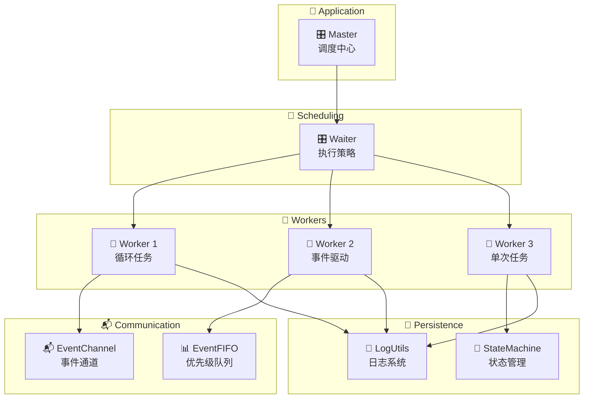
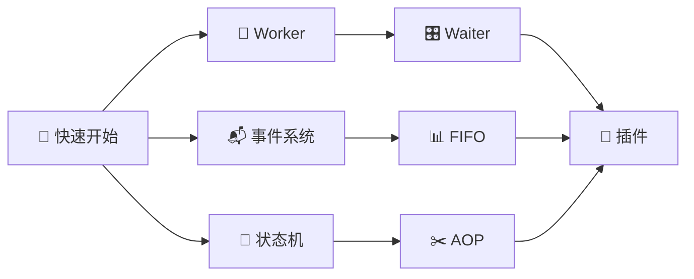

# 🚀 快速开始

## 📦 安装

### 使用 pip 安装

::: code-group

```bash [推荐]
pip install zoo-framework
```

```bash [开发版本]
pip install -e git+https://github.com/YearsAlso/zoo-framework.git#egg=zoo-framework
```

:::

### 从源码安装

```bash
git clone https://github.com/YearsAlso/zoo-framework.git
cd zoo-framework
pip install -e .
```

## 🎯 创建第一个项目

### 1️⃣ 使用 CLI 创建项目

```bash
zfc --create my_first_project
cd my_first_project
```

这将创建以下结构：

```
my_first_project/
├── 📄 config.json          # 配置文件
├── 📁 src/                 # 源代码目录
│   ├── 🚀 main.py         # 应用入口
│   ├── 👷 workers/        # Worker 目录
│   │   └── __init__.py
│   ├── 📬 events/         # 事件目录
│   │   └── __init__.py
│   ├── ⚙️ conf/           # 配置目录
│   │   └── __init__.py
│   └── 📋 params/         # 参数目录
│       └── __init__.py
└── 📁 logs/               # 日志目录
```

### 📄 config.json

```json
{
  "_exports": [],
  "📝 log": {
    "📁 path": "./logs",
    "📊 level": "debug"
  },
  "👷 worker": {
    "🎛️ runPolicy": "simple",
    "🏊 pool": {
      "🔢 size": 5,
      "✅ enabled": false
    }
  }
}
```

配置项说明：

| 🔧 配置项 | 📋 类型 | 📝 说明 |
|-----------|---------|---------|
| `log.path` | 📁 string | 日志文件存储路径 |
| `log.level` | 📊 string | 日志级别 (debug/info/warning/error) |
| `worker.runPolicy` | 🎛️ string | Worker 运行策略 (simple/stable/safe) |
| `worker.pool.enabled` | ✅ boolean | 是否启用线程池 |
| `worker.pool.size` | 🔢 integer | 线程池大小 |

## 👷 创建 Worker

```bash
zfc --worker hello
```

这会在 `src/workers/` 目录下创建 `hello_worker.py`：

```python
from zoo_framework.workers.base_worker import BaseWorker


class HelloWorker(BaseWorker):
    def __init__(self):
        BaseWorker.__init__(self, {
            "is_loop": True,
            "delay_time": 5,
            "name": "HelloWorker"
        })

    def _destroy(self, result):
        pass

    def _execute(self):
        # 📝 在这里编写你的业务逻辑
        pass
```

同时在 `src/workers/__init__.py` 中自动注册：

```python
from .hello_worker import HelloWorker
```

## 💻 编写业务代码

修改 `src/workers/hello_worker.py`：

```python
from zoo_framework.workers import BaseWorker
from zoo_framework.utils import LogUtils


class HelloWorker(BaseWorker):
    """
    👋 欢迎 Worker - 演示基础功能
    """
    
    def __init__(self):
        super().__init__({
            "is_loop": True,      # 🔄 循环执行
            "delay_time": 2,      # ⏱️ 每 2 秒执行一次
            "name": "HelloWorker" # 🏷️ Worker 名称
        })
        self.counter = 0

    def _destroy(self, result):
        """
        🗑️ 销毁回调 - Worker 停止时调用
        """
        LogUtils.info(f"👋 Worker 结束，执行次数: {result}")

    def _execute(self):
        """
        ⚡ 执行业务逻辑 - 必须实现
        """
        self.counter += 1
        LogUtils.info(f"✨ Hello Zoo Framework! Count: {self.counter}")
```

## 🚀 启动应用

修改 `src/main.py`：

```python
from zoo_framework.core import Master

def main():
    """
    🚀 应用入口
    """
    # 🎯 创建 Master 实例
    master = Master(loop_interval=1)
    
    # ▶️ 运行应用
    master.run()

if __name__ == "__main__":
    main()
```

运行：

```bash
cd src
python main.py
```

预期输出：

```
[📅 2024-01-15 10:00:00] [INFO] 🚀 Zoo Framework 启动
[📅 2024-01-15 10:00:00] [INFO] 👷 HelloWorker 注册成功
[📅 2024-01-15 10:00:02] [INFO] ✨ Hello Zoo Framework! Count: 1
[📅 2024-01-15 10:00:04] [INFO] ✨ Hello Zoo Framework! Count: 2
[📅 2024-01-15 10:00:06] [INFO] ✨ Hello Zoo Framework! Count: 3
...
```

## 🏗️ 项目架构图



## 📚 核心概念速览

### 👷 Worker - 工作器

Worker 是 Zoo Framework 的基本执行单元：

```python
from zoo_framework.workers import BaseWorker

class MyWorker(BaseWorker):
    def __init__(self):
        super().__init__({
            "is_loop": True,      # 🔄 是否循环
            "delay_time": 1,      # ⏱️ 执行间隔
            "name": "MyWorker"    # 🏷️ 名称
        })
    
    def _execute(self):
        # ⚡ 业务逻辑
        pass
```

### 📬 事件

```python
from zoo_framework.event import EventChannelManager
from zoo_framework.fifo import EventFIFO
from zoo_framework.fifo.node import EventNode

# 📤 创建事件
node = EventNode(
    topic="user.login",
    content={"user_id": 123, "name": "张三"},
    priority=10
)

# 📨 发送事件
EventChannelManager.get_channel("default").push(node)
```

### 🔄 状态机

```python
from zoo_framework.statemachine import StateMachineManager

# 🎯 创建状态机
sm = StateMachineManager()
sm.create_state_machine("order")

# ➕ 添加状态
sm.add_state("order", "created")
sm.add_state("order", "paid")
sm.add_state("order", "shipped")

# 🔄 状态转换
sm.transfer("order", "created", "paid")
```

## 🗺️ 下一步学习路径



1. [👷 深入了解 Worker →](/core/worker.html)
2. [📬 学习事件系统 →](/core/event.html)
3. [🔄 掌握状态机 →](/core/statemachine.html)
4. [📊 了解 FIFO 队列 →](/core/fifo.html)

## ❓ 常见问题

### Q: Worker 没有被执行？

A: 确保 Worker 已在 `workers/__init__.py` 中导入：

```python
from .hello_worker import HelloWorker
```

### Q: 如何调试？

A: 设置日志级别为 debug：

```json
{
  "log": {
    "level": "debug"
  }
}
```

### Q: 如何停止 Worker？

A: 设置 `is_loop = False`：

```python
def __init__(self):
    super().__init__({
        "is_loop": False,  # 🔴 只执行一次
        "name": "OneTimeWorker"
    })
```

## 🎉 恭喜！

你已经完成了 Zoo Framework 的第一个项目！🎊

继续探索更多功能：
- [📖 核心概念](/core/worker.html)
- [🔧 高级特性](/advanced/aop.html)
- [📚 API 参考](/api/core.html)
