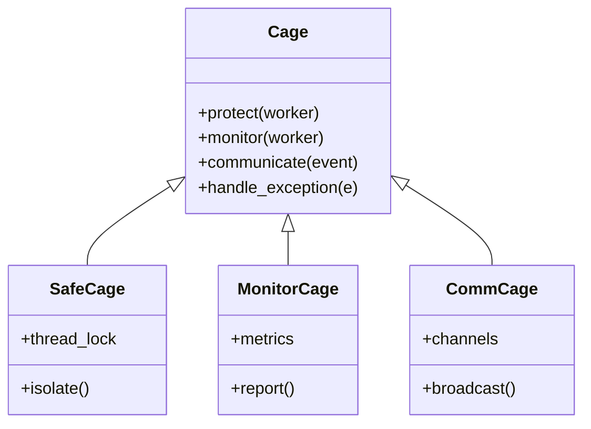
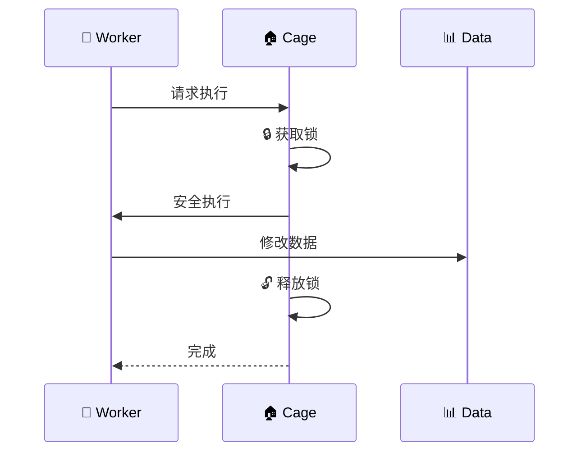
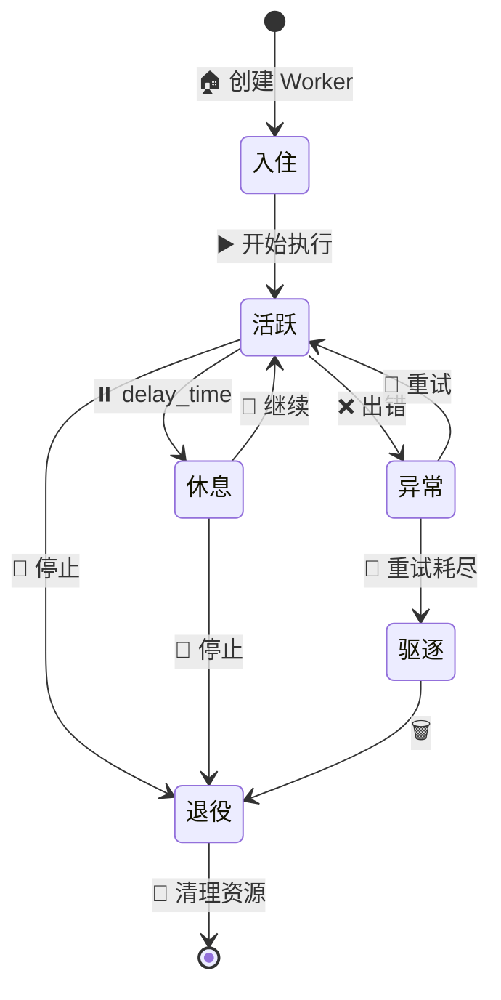
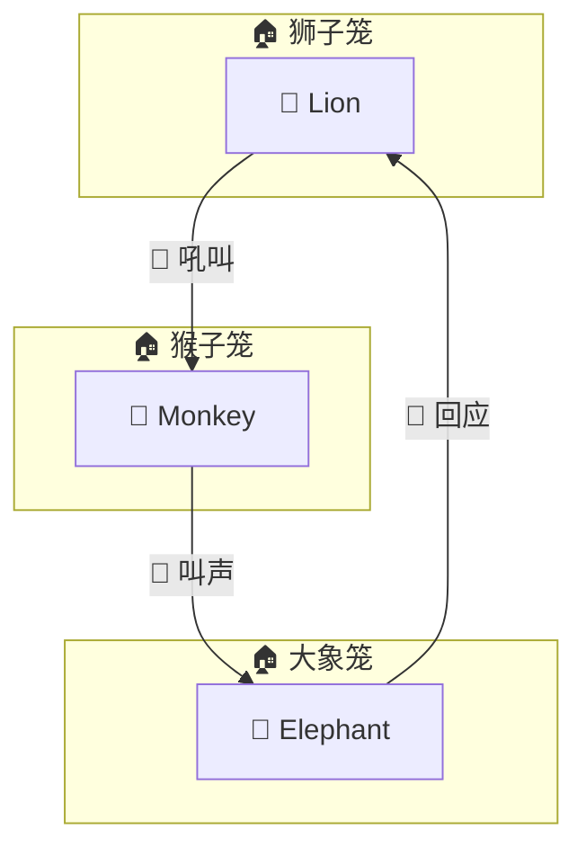

# 🏠 Cage 笼子 - 动物们的家

> 在 Zoo Framework 中，**Cage（笼子）** 是 Worker（动物）们的家。就像动物园里的笼子保护动物、管理动物一样，Cage 保护线程安全、管理 Worker 生命周期。

## 🎯 什么是 Cage？

```mermaid
graph TB
    subgraph 🏠 Cage 笼子
        direction TB
        S[🔒 安全防护<br/>线程隔离]
        L[🔄 生命周期<br/>管理]
        C[📢 通信系统<br/>事件传递]
        M[📊 监控仪表<br/>状态跟踪]
    end
    
    W[🦁 Worker 动物] -->|住| Cage
    
    style Cage fill:#e8f5e9,stroke:#2e7d32,stroke-width:3px
```

### 🏠 Cage 的职责

| 🎯 职责 | 📝 说明 | 💡 类比 |
|---------|---------|---------|
| 🔒 **安全防护** | 防止 Worker 乱跑（线程安全） | 笼子防止动物逃跑 |
| 🔄 **作息管理** | 管理 Worker 的生命周期 | 管理动物的作息 |
| 📢 **通信系统** | Worker 之间的消息传递 | 笼子之间的传声筒 |
| 📊 **健康监控** | 监控 Worker 运行状态 | 监控动物健康 |
| 🛡️ **异常处理** | 捕获并处理异常 | 处理动物突发状况 |

## 🏗️ Cage 的架构



## 🔒 Cage 安全防护

### 线程安全笼子

```python
from zoo_framework.core.aop import Cage
from zoo_framework.workers import BaseWorker

@Cage.protect  # 🏠 把 Worker 放进安全笼子
class SafeWorker(BaseWorker):
    """
    🐒 住在安全笼子里的猴子 Worker
    """
    def __init__(self):
        super().__init__({
            "name": "🐒 SafeMonkey",
            "delay_time": 1
        })
        self.food_count = 0  # 🍌 食物计数
    
    def _execute(self):
        # 🔒 Cage 确保线程安全
        self.food_count += 1
        print(f"🐒 我在笼子里安全地吃了 {self.food_count} 根香蕉！")
```



### 带锁的笼子

```python
from zoo_framework.lock import CountLock
from zoo_framework.core.aop import Cage

class LimitedCage(Cage):
    """
    📏 有限容量的笼子
    最多同时容纳 N 只动物
    """
    def __init__(self, max_animals=5):
        self.lock = CountLock(max_count=max_animals)
    
    def enter(self, worker):
        """
        🚪 动物进入笼子
        """
        if self.lock.acquire():
            print(f"🦁 {worker.name} 进入笼子")
            return True
        else:
            print(f"⛔ 笼子已满，{worker.name} 等待")
            return False
    
    def leave(self, worker):
        """
        🚪 动物离开笼子
        """
        self.lock.release()
        print(f"🦁 {worker.name} 离开笼子")
```

## 🔄 Cage 生命周期管理

### 动物的作息时间表



### Cage 生命周期钩子

```python
from zoo_framework.workers import BaseWorker
from zoo_framework.core.aop import Cage

@Cage.manage  # 🏠 Cage 管理生命周期
class ManagedWorker(BaseWorker):
    """
    🐘 被 Cage 管理的大象 Worker
    """
    
    def __init__(self):
        super().__init__({
            "name": "🐘 BigElephant",
            "is_loop": True,
            "delay_time": 3
        })
    
    @Cage.on_enter  # 🚪 进入笼子时
    def on_enter(self):
        print("🐘 大象进入笼子，准备开始工作")
        self.setup_resources()
    
    @Cage.on_execute  # ⚡ 执行时
    def _execute(self):
        print("🐘 大象正在搬运重物...")
    
    @Cage.on_error  # ❌ 出错时
    def on_error(self, error):
        print(f"❌ 大象出错了: {error}")
        self.report_to_zookeeper()  # 📢 报告园长
    
    @Cage.on_exit  # 🚪 离开笼子时
    def on_exit(self):
        print("🐘 大象离开笼子，清理环境")
        self.cleanup_resources()
```

## 📢 Cage 通信系统

### 笼子之间的传声筒



### 代码实现

```python
from zoo_framework.core.aop import Cage
from zoo_framework.event import EventChannelManager

@Cage.communicate  # 📢 启用通信功能
class CommunicatingWorker(BaseWorker):
    """
    🐒 会和其他动物交流的猴子
    """
    
    def __init__(self):
        super().__init__({
            "name": "🐒 SocialMonkey",
            "delay_time": 2
        })
        self.channel = EventChannelManager.get_channel("zoo")
    
    def _execute(self):
        # 📤 向其他笼子广播
        self.channel.push(EventNode(
            topic="monkey.chatter",
            content={"message": "🍌 我找到香蕉了！"},
            priority=50
        ))
        
        # 📥 监听其他笼子的消息
        message = self.channel.pop()
        if message:
            self.respond(message)
    
    def respond(self, message):
        if message.topic == "lion.roar":
            print("🐒 哎呀，狮子在吼叫，我要安静！")
        elif message.topic == "elephant.trumpet":
            print("🐒 大象在打招呼，我也回应一下！")
```

## 📊 Cage 监控系统

### 动物健康监控

```python
from zoo_framework.core.aop import Cage
from zoo_framework.utils import LogUtils
import time

@Cage.monitor  # 📊 开启监控
class MonitoredWorker(BaseWorker):
    """
    🦅 被监控的老鹰 Worker
    """
    
    def __init__(self):
        super().__init__({
            "name": "🦅 EagleEye",
            "delay_time": 1
        })
        self.metrics = {
            "execute_count": 0,
            "error_count": 0,
            "avg_execute_time": 0
        }
    
    def _execute(self):
        start = time.time()
        
        try:
            # ⚡ 执行业务逻辑
            self.hunt()
            
            # 📊 记录成功指标
            self.metrics["execute_count"] += 1
            
        except Exception as e:
            # 📊 记录失败指标
            self.metrics["error_count"] += 1
            LogUtils.error(f"🦅 老鹰捕猎失败: {e}")
        
        # ⏱️ 计算执行时间
        duration = time.time() - start
        self.update_avg_time(duration)
        
        # 📤 上报监控数据
        self.report_metrics()
    
    def update_avg_time(self, duration):
        """
        📊 更新平均执行时间
        """
        n = self.metrics["execute_count"]
        old_avg = self.metrics["avg_execute_time"]
        self.metrics["avg_execute_time"] = (old_avg * (n-1) + duration) / n
    
    def report_metrics(self):
        """
        📤 上报监控数据给 Master（园长）
        """
        LogUtils.info(
            f"🦅 {self.name} 健康报告: "
            f"执行次数={self.metrics['execute_count']}, "
            f"错误次数={self.metrics['error_count']}, "
            f"平均耗时={self.metrics['avg_execute_time']:.3f}s"
        )
```

## 🎪 不同类型的笼子

### 🏠 安全笼（Safe Cage）

```python
from zoo_framework.core.aop.cage import SafeCage

@SafeCage()  # 🔒 最高安全级别的笼子
class VIPWorker(BaseWorker):
    """
    🐅 老虎 VIP - 住在最高安全级别的笼子里
    """
    def _execute(self):
        print("🐅 我是老虎，住在加固的笼子里！")
```

### 🏠 监控笼（Monitor Cage）

```python
from zoo_framework.core.aop.cage import MonitorCage

@MonitorCage(metrics_interval=60)  # 📊 每分钟报告一次
class ObservedWorker(BaseWorker):
    """
    🦒 长颈鹿 - 被持续监控
    """
    def _execute(self):
        print("🦒 我在监控下优雅地工作")
```

### 🏠 通信笼（Comm Cage）

```python
from zoo_framework.core.aop.cage import CommCage

@CommCage(channels=["zoo", "food", "alert"])  # 📢 订阅多个频道
class SocialWorker(BaseWorker):
    """
    🐧 企鹅 - 善于社交
    """
    def _execute(self):
        print("🐧 我在多个频道中交流")
```

## 🎪 完整示例：动物园的一天

```python
from zoo_framework.core import Master
from zoo_framework.workers import BaseWorker
from zoo_framework.core.aop import Cage
from zoo_framework.event import EventChannelManager
from zoo_framework.fifo.node import EventNode


@Cage.protect  # 🏠 住进笼子
@Cage.monitor  # 📊 被监控
class LionWorker(BaseWorker):
    """
    🦁 狮子王 - 住在最安全的笼子里
    """
    def __init__(self):
        super().__init__({
            "name": "🦁 LionKing",
            "delay_time": 3,
            "priority": 100  # 🔴 最高优先级
        })
    
    def _execute(self):
        print("🦁 吼！我是狮子王，正在巡视领地！")
        
        # 📢 吼叫通知其他动物
        EventChannelManager.get_channel("zoo").push(
            EventNode("lion.roar", {"power": 100}, priority=100)
        )


@Cage.protect
class MonkeyWorker(BaseWorker):
    """
    🐒 猴子 - 住在普通笼子里，很活跃
    """
    def __init__(self):
        super().__init__({
            "name": "🐒 Monkey",
            "delay_time": 1
        })
    
    def _execute(self):
        # 📥 听狮子的吼叫
        event = EventChannelManager.get_channel("zoo").pop()
        if event and event.topic == "lion.roar":
            print("🐒 哎呀，狮子吼了，我要安静...")
        else:
            print("🐒 吱吱！我在笼子里玩耍！")


# 🎪 动物园开园
if __name__ == "__main__":
    print("🎪 动物园开园啦！动物们住进笼子里准备表演！")
    master = Master()
    master.run()
```

输出：
```
🎪 动物园开园啦！动物们住进笼子里准备表演！
🦁 吼！我是狮子王，正在巡视领地！
🐒 哎呀，狮子吼了，我要安静...
🦁 吼！我是狮子王，正在巡视领地！
🐒 吱吱！我在笼子里玩耍！
```

## ✅ Cage 最佳实践

### 1️⃣ 选择合适的笼子

| 🏠 笼子类型 | 📝 适用场景 | 🦁 动物示例 |
|------------|------------|------------|
| 🔒 SafeCage | 需要线程安全 | 🦁 狮子、🐅 老虎 |
| 📊 MonitorCage | 需要监控 | 🦅 老鹰、🦒 长颈鹿 |
| 📢 CommCage | 需要大量通信 | 🐒 猴子、🐧 企鹅 |
| 🎪 FullCage | 需要全部功能 | 🐘 大象 |

### 2️⃣ 笼子容量规划

```python
# 🏠 创建大笼子 - 容纳大型动物
@Cage(size="large")
class BigWorker(BaseWorker):
    pass

# 🏠 创建小笼子 - 容纳小型动物
@Cage(size="small")
class SmallWorker(BaseWorker):
    pass
```

### 3️⃣ 笼子安全检查清单

- [x] 🔒 线程锁是否正确获取和释放？
- [x] 📊 监控指标是否正常上报？
- [x] 📢 通信频道是否正确配置？
- [x] 🛡️ 异常处理是否完善？
- [x] 🧹 资源是否正确清理？

---

> 🎪 **记住**：在 Zoo Framework 中，每只 Worker 都应该住在合适的 Cage 里，这样动物园才能安全、有序地运转！
