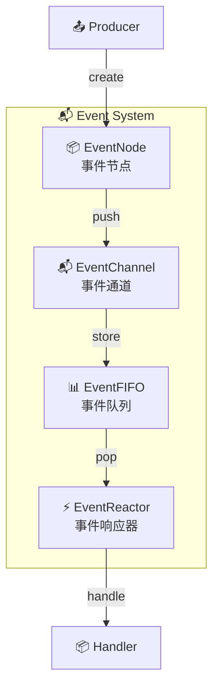
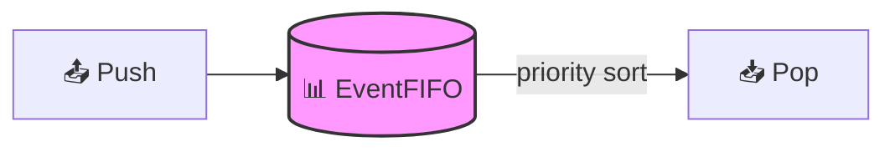
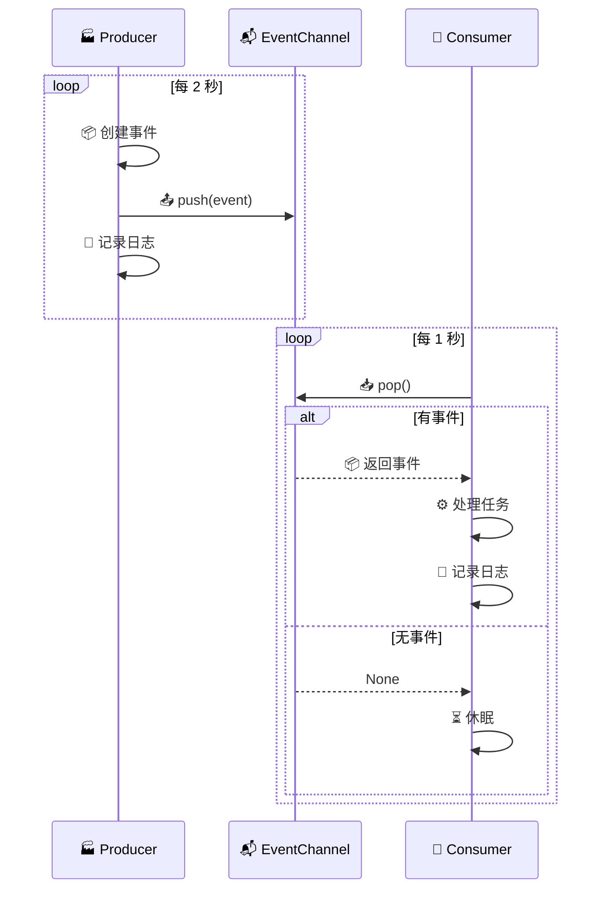
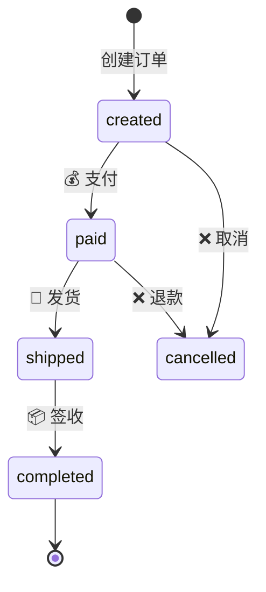
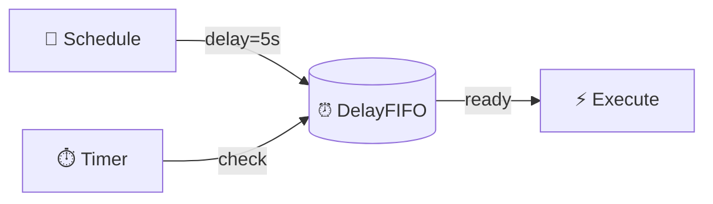
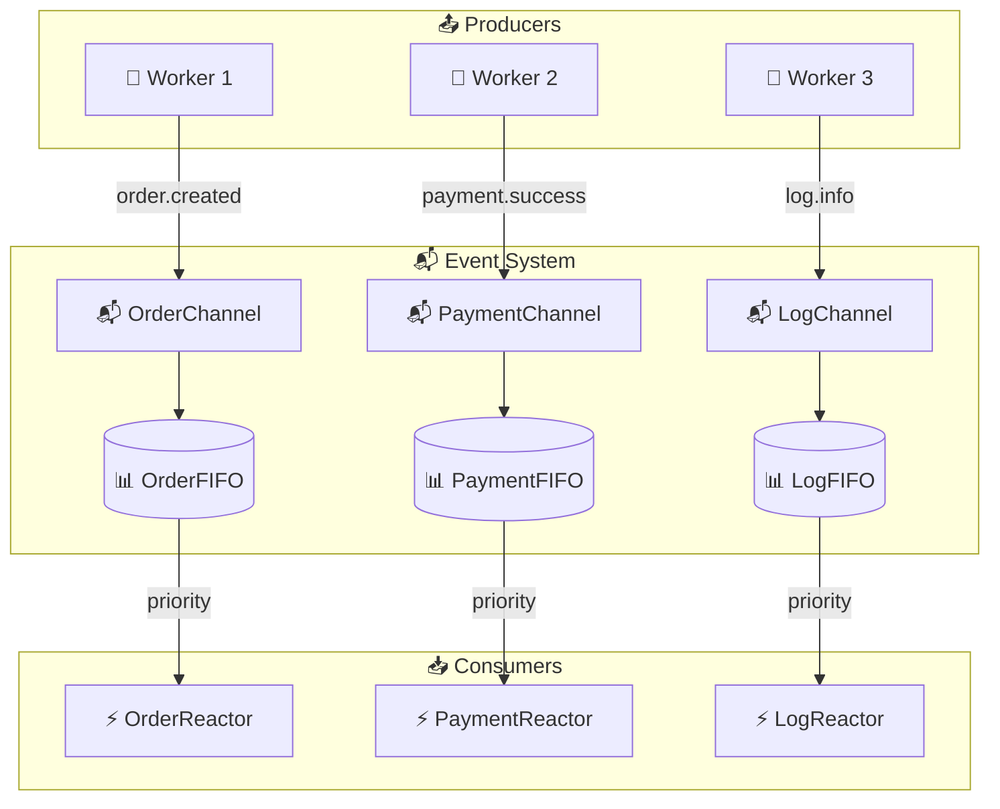

# 📬 事件系统

Zoo Framework 提供了完整的事件驱动机制，支持基于事件的生产者-消费者模式。

## 🎯 核心概念



| 🧩 组件 | 📝 说明 |
|---------|---------|
| 📦 **EventNode** | 事件节点，代表一个具体的事件 |
| 📬 **EventChannel** | 事件通道，事件的传输管道 |
| 📊 **EventFIFO** | 事件队列，支持优先级的事件存储 |
| ⚡ **EventReactor** | 事件响应器，处理事件的具体逻辑 |

## 📦 EventNode 事件节点

事件是系统中的基本通信单元。

### 📝 创建事件

```python
from zoo_framework.fifo.node import EventNode

# 📄 创建简单事件
node = EventNode(
    topic="user.login",                              # 🏷️ 事件主题
    content={"user_id": 123, "username": "张三"}       # 📦 事件内容
)

# ⭐ 创建带优先级的事件
urgent_node = EventNode(
    topic="order.urgent",
    content={"order_id": "12345"},
    priority=100  # 🔴 高优先级
)

# ⏰ 创建带超时的事件
timeout_node = EventNode(
    topic="payment.process",
    content={"amount": 99.99},
    timeout=30,  # ⏱️ 30秒超时
    timeout_response=on_payment_timeout
)
```

### 📊 EventNode 属性

| 🏷️ 属性 | 📋 类型 | 📝 说明 |
|---------|---------|---------|
| `topic` | 🏷️ str | 事件主题（标识符）|
| `content` | 📦 any | 事件内容（数据）|
| `priority` | 🔢 int | 优先级（数值越大优先级越高）|
| `channel_name` | 📁 str | 所属通道名称 |
| `timeout` | ⏱️ int | 超时时间（秒）|
| `retry_times` | 🔄 int | 重试次数 |
| `create_time` | 📅 int | 创建时间戳 |
| `is_response` | ✅ bool | 是否已响应 |

### 🔧 事件响应机制

```python
# ❌ 设置失败回调
node.set_fail_response(
    lambda node: print(f"❌ 处理失败: {node.topic}")
)

# ⏰ 设置超时回调
node.set_timeout(
    30, 
    lambda node: print(f"⏰ 处理超时: {node.topic}")
)

# 🎯 设置响应机制
# 1️⃣: 先抢到先响应
# 2️⃣: 优先级高的先响应
# 3️⃣: 全部响应（默认）
# 4️⃣: 指定响应者
node.set_response_mechanism(4, reactor_name="PaymentReactor")
```

## 📬 EventChannel 事件通道

事件通道是事件的分发管道。

### 🎯 获取通道

```python
from zoo_framework.event import EventChannelManager

# 📬 获取默认通道
default_channel = EventChannelManager.get_channel("default")

# 🛒 获取订单通道
order_channel = EventChannelManager.get_channel("order")

# 💰 获取支付通道
payment_channel = EventChannelManager.get_channel("payment")
```

### 🔧 通道操作

```python
# 📤 发送事件
node = EventNode("user.login", {"user_id": 123})
channel.push(node)

# 📥 接收事件
node = channel.pop()
if node:
    print(f"📨 收到事件: {node.topic}")

# 📊 查看队列大小
size = channel.size()

# 🗑️ 清空通道
channel.clear()
```

## 📊 EventFIFO 事件队列

先进先出的事件队列，支持优先级排序。



### 📝 创建队列

```python
from zoo_framework.fifo import EventFIFO

# 📊 创建队列
fifo = EventFIFO()

# ⏰ 创建带延迟功能的队列
from zoo_framework.fifo import DelayFIFO
delay_fifo = DelayFIFO()
```

### 🔧 队列操作

```python
# ➕ 添加事件
node1 = EventNode("task.low", "data", priority=1)
node2 = EventNode("task.high", "data", priority=10)

fifo.push(node1)
fifo.push(node2)

# ⬆️ 获取事件（按优先级）
node = fifo.pop()  # 📤 返回 node2（priority=10）

# 📏 查看队列长度
count = len(fifo)

# ✅ 判断队列是否为空
is_empty = fifo.is_empty()

# 📋 获取所有事件
all_nodes = fifo.get_all()
```

## 💡 完整示例

### 🏪 生产者-消费者模式

```python
from zoo_framework.workers import BaseWorker
from zoo_framework.event import EventChannelManager
from zoo_framework.fifo.node import EventNode
from zoo_framework.utils import LogUtils
import time


class ProducerWorker(BaseWorker):
    """
    🏭 生产者 - 生成事件
    """
    
    def __init__(self):
        super().__init__({
            "is_loop": True,
            "delay_time": 2,
            "name": "ProducerWorker"
        })
        self.counter = 0
    
    def _execute(self):
        self.counter += 1
        
        # 🎯 根据类型设置优先级
        if self.counter % 5 == 0:
            priority = 100  # 🔴 每第5个任务高优先级
            topic = "task.urgent"
        else:
            priority = 10
            topic = "task.normal"
        
        node = EventNode(
            topic=topic,
            content={
                "id": self.counter,
                "timestamp": time.time()
            },
            priority=priority
        )
        
        # 📤 发送到通道
        channel = EventChannelManager.get_channel("order")
        channel.push(node)
        
        LogUtils.info(f"🏭 生产: {topic} #{self.counter}")


class ConsumerWorker(BaseWorker):
    """
    🏪 消费者 - 处理事件
    """
    
    def __init__(self):
        super().__init__({
            "is_loop": True,
            "delay_time": 1,
            "name": "ConsumerWorker"
        })
    
    def _execute(self):
        channel = EventChannelManager.get_channel("order")
        node = channel.pop()
        
        if node:
            self.process(node)
        else:
            # ⏳ 队列为空，短暂休眠
            time.sleep(0.5)
    
    def process(self, node):
        LogUtils.info(f"🏪 消费: {node.topic} #{node.content['id']}")
        # ⚙️ 处理任务
        time.sleep(0.5)
```



### 🔄 事件驱动状态机

```python
from zoo_framework.statemachine import StateMachineManager


class StateMachineEventWorker(BaseWorker):
    """
    🔄 使用事件驱动状态机
    """
    
    def __init__(self):
        super().__init__({
            "is_loop": True,
            "delay_time": 1,
            "name": "StateMachineEventWorker"
        })
        self.setup_state_machine()
    
    def setup_state_machine(self):
        sm = StateMachineManager()
        sm.create_state_machine("order")
        
        # ➕ 添加状态
        sm.add_state("order", "created")
        sm.add_state("order", "paid")
        sm.add_state("order", "shipped")
        sm.add_state("order", "completed")
        
        # 🔗 添加状态转换效果
        sm.add_effect("order", "created", "paid", self.on_paid)
        sm.add_effect("order", "paid", "shipped", self.on_shipped)
    
    def _execute(self):
        channel = EventChannelManager.get_channel("order")
        node = channel.pop()
        
        if node:
            self.handle_event(node)
    
    def handle_event(self, node):
        sm = StateMachineManager()
        
        if node.topic == "order.paid":
            sm.transfer("order", "created", "paid")
        elif node.topic == "order.shipped":
            sm.transfer("order", "paid", "shipped")
    
    def on_paid(self, data):
        LogUtils.info(f"💰 订单支付: {data}")
    
    def on_shipped(self, data):
        LogUtils.info(f"🚚 订单发货: {data}")
```



### ⏰ 延迟事件处理

```python
from zoo_framework.fifo import DelayFIFO
from zoo_framework.fifo.node import DelayFIFONode
import time


class DelayedEventWorker(BaseWorker):
    """
    ⏰ 延迟事件处理
    """
    
    def __init__(self):
        super().__init__({
            "is_loop": True,
            "delay_time": 1,
            "name": "DelayedEventWorker"
        })
        self.delay_fifo = DelayFIFO()
    
    def schedule_task(self, task, delay_seconds):
        """
        📅 安排延迟任务
        """
        node = DelayFIFONode(
            topic="scheduled.task",
            content=task,
            delay=delay_seconds
        )
        self.delay_fifo.push(node)
        return node
    
    def schedule_at(self, task, timestamp):
        """
        📅 在指定时间执行任务
        """
        import time
        delay = timestamp - time.time()
        if delay > 0:
            return self.schedule(task, delay)
        return None
    
    def _execute(self):
        # ⏰ 获取已到期的任务
        ready_nodes = self.delay_fifo.get_ready_nodes()
        
        for node in ready_nodes:
            self.execute_task(node.content)
            self.delay_fifo.remove(node)
    
    def execute_task(self, task):
        LogUtils.info(f"⚡ 执行延迟任务: {task}")
```



## ✅ 最佳实践

### 1️⃣ 合理设置事件优先级

```python
# 🔴 系统级事件 - 最高优先级
SYSTEM_PRIORITY = 100

# 🟠 业务关键事件
BUSINESS_PRIORITY = 50

# 🟢 普通业务事件
NORMAL_PRIORITY = 10

# ⚪ 日志/监控事件 - 最低优先级
LOG_PRIORITY = 1
```

### 2️⃣ 事件主题命名规范

```python
# ✅ 使用点分命名空间
"user.login"           # 👤 用户登录
"user.logout"          # 👤 用户登出
"order.created"        # 📦 订单创建
"order.paid"           # 💰 订单支付
"order.cancelled"      # ❌ 订单取消
"inventory.updated"    # 📊 库存更新
```

### 3️⃣ 异常处理

```python
def _execute(self):
    try:
        node = self.channel.pop()
        if node:
            self.handle(node)
    except Exception as e:
        LogUtils.error(f"❌ 事件处理错误: {e}")
        # 🔄 可选：将失败事件发送到重试队列
        self.send_to_retry_queue(node)
```

### 4️⃣ 避免事件丢失

```python
def _execute(self):
    node = self.channel.pop()
    
    if node:
        try:
            result = self.process(node)
            node.is_response = True
        except Exception as e:
            node.retry_times += 1
            if node.retry_times < self.max_retries:
                # 🔄 重新放入队列
                self.channel.push(node)
            else:
                # 📛 进入死信队列
                self.send_to_dlq(node)
```

## 📊 事件系统架构图


