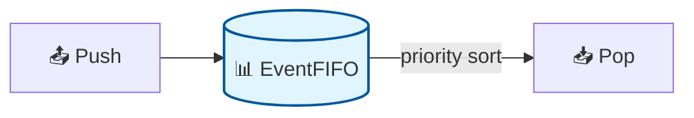
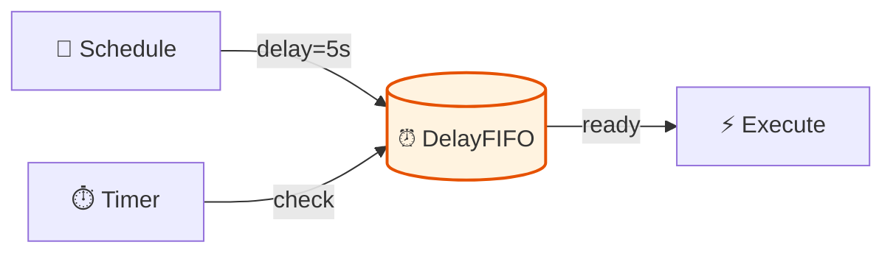
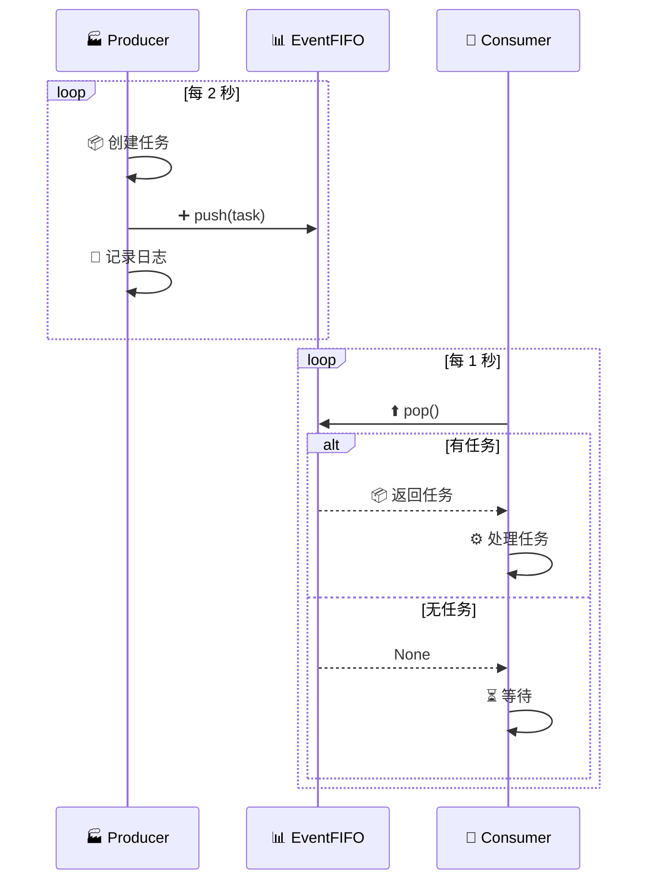

# 📊 FIFO 队列

Zoo Framework 提供了多种 FIFO（先进先出）队列实现，支持优先级和延迟执行。

## 📦 EventFIFO 事件队列

基础的事件队列，支持优先级排序。



### 📝 基本使用

```python
from zoo_framework.fifo import EventFIFO
from zoo_framework.fifo.node import EventNode

# 📊 创建队列
fifo = EventFIFO()

# ➕ 添加事件
node1 = EventNode("task1", "data1", priority=1)
node2 = EventNode("task2", "data2", priority=10)
node3 = EventNode("task3", "data3", priority=5)

fifo.push(node1)
fifo.push(node2)
fifo.push(node3)

# ⬆️ 获取事件（按优先级）
node = fifo.pop()  # 📤 返回 node2（priority=10）
```

### 🔧 队列操作

| 🔧 操作 | 📝 说明 | 📤 示例 |
|---------|---------|---------|
| `push(node)` | ➕ 添加事件 | `fifo.push(node)` |
| `pop()` | ⬆️ 获取并移除 | `node = fifo.pop()` |
| `len(fifo)` | 📏 队列大小 | `size = len(fifo)` |
| `is_empty()` | ✅ 是否为空 | `if fifo.is_empty()` |
| `get_all()` | 📋 获取所有 | `nodes = fifo.get_all()` |
| `clear()` | 🗑️ 清空 | `fifo.clear()` |
| `remove(node)` | ❌ 移除指定 | `fifo.remove(node)` |
| `contains(node)` | 🔍 是否包含 | `if fifo.contains(node)` |

### ⭐ 优先级机制

队列按优先级自动排序，优先级高的先出队。

```python
import time

# 🔴 创建高优先级事件
urgent = EventNode(
    topic="system.alert",
    content="服务器负载过高",
    priority=100,  # 🔴 高优先级
    channel_name="system"
)

# 🟡 创建普通事件
normal = EventNode(
    topic="user.action",
    content="用户点击",
    priority=10,  # 🟡 普通优先级
    channel_name="user"
)

# 🟢 创建低优先级事件
low = EventNode(
    topic="log.write",
    content="写入日志",
    priority=1,  # 🟢 低优先级
    channel_name="log"
)

# ➕ 入队顺序：low -> normal -> urgent
fifo.push(low)
fifo.push(normal)
fifo.push(urgent)

# ⬆️ 出队顺序：urgent -> normal -> low
```

```mermaid
graph TB
    subgraph 📊 Priority Queue
        direction TB
        P1[🔴 Priority 100<br/>system.alert] 
        P2[🟡 Priority 10<br/>user.action]
        P3[🟢 Priority 1<br/>log.write]
    end
    
    P1 -->|pop| O1[📤 Output]
    P2 -->|pop| O1
    P3 -->|pop| O1
    
    style P1 fill:#ffcdd2
    style P2 fill:#fff9c4
    style P3 fill:#c8e6c9
```

## ⏰ DelayFIFO 延迟队列

支持延迟执行的队列，事件在指定时间后才可消费。



### 📝 基本使用

```python
from zoo_framework.fifo import DelayFIFO
from zoo_framework.fifo.node import DelayFIFONode

# ⏰ 创建延迟队列
delay_fifo = DelayFIFO()

# 📅 创建延迟事件（5秒后执行）
node = DelayFIFONode(
    topic="delayed.task",
    content={"action": "send_email"},
    delay=5  # ⏱️ 延迟 5 秒
)

delay_fifo.push(node)

# ⏰ 获取可执行的事件
ready_nodes = delay_fifo.get_ready_nodes()
for node in ready_nodes:
    print(f"⚡ 执行: {node.topic}")
```

### 📅 延迟任务调度器

```python
from zoo_framework.workers import BaseWorker
from zoo_framework.fifo import DelayFIFO
from zoo_framework.fifo.node import DelayFIFONode


class DelayedTaskScheduler(BaseWorker):
    """
    📅 延迟任务调度器
    """
    
    def __init__(self):
        super().__init__({
            "is_loop": True,
            "delay_time": 1,
            "name": "DelayedTaskScheduler"
        })
        self.delay_fifo = DelayFIFO()
    
    def schedule(self, task, delay_seconds):
        """
        📅 安排延迟任务
        """
        node = DelayFIFONode(
            topic="scheduled.task",
            content=task,
            delay=delay_seconds
        )
        self.delay_fifo.push(node)
        return node
    
    def schedule_at(self, task, timestamp):
        """
        📅 在指定时间执行任务
        """
        import time
        delay = timestamp - time.time()
        if delay > 0:
            return self.schedule(task, delay)
        return None
    
    def _execute(self):
        # ⏰ 获取所有到期的任务
        ready_nodes = self.delay_fifo.get_ready_nodes()
        
        for node in ready_nodes:
            self.execute_task(node.content)
            self.delay_fifo.remove(node)
    
    def execute_task(self, task):
        """
        ⚡ 执行任务
        """
        print(f"⚡ 执行: {task}")


# 💡 使用示例
scheduler = DelayedTaskScheduler()

# ⏰ 延迟 10 秒发送邮件
scheduler.schedule({
    "type": "email",
    "to": "user@example.com",
    "subject": "订单确认"
}, 10)

# 📅 延迟 1 小时清理数据
scheduler.schedule({
    "type": "cleanup",
    "target": "temp_files"
}, 3600)
```

## 💡 完整示例

### 🏭 生产者-消费者模式

```python
from zoo_framework.workers import BaseWorker
from zoo_framework.fifo import EventFIFO
from zoo_framework.fifo.node import EventNode
import time


class ProducerWorker(BaseWorker):
    """
    🏭 生产者
    """
    
    def __init__(self, fifo):
        super().__init__({
            "is_loop": True,
            "delay_time": 2,
            "name": "ProducerWorker"
        })
        self.fifo = fifo
        self.counter = 0
    
    def _execute(self):
        self.counter += 1
        
        # 🎯 根据类型设置优先级
        if self.counter % 5 == 0:
            priority = 100  # 🔴 每第5个任务高优先级
            topic = "task.urgent"
        else:
            priority = 10
            topic = "task.normal"
        
        node = EventNode(
            topic=topic,
            content={"id": self.counter, "timestamp": time.time()},
            priority=priority
        )
        
        self.fifo.push(node)
        print(f"🏭 生产: {topic} #{self.counter}")


class ConsumerWorker(BaseWorker):
    """
    🏪 消费者
    """
    
    def __init__(self, fifo):
        super().__init__({
            "is_loop": True,
            "delay_time": 1,
            "name": "ConsumerWorker"
        })
        self.fifo = fifo
    
    def _execute(self):
        node = self.fifo.pop()
        
        if node:
            self.process(node)
        else:
            print("⏳ 队列空，等待...")
            time.sleep(0.5)
    
    def process(self, node):
        print(f"🏪 消费: {node.topic} #{node.content['id']}")
        time.sleep(0.5)
```



### 🎯 优先级任务调度

```python
class PriorityTaskScheduler:
    """
    🎯 优先级任务调度器
    """
    
    PRIORITY_LEVELS = {
        "🔴 CRITICAL": 1000,  # 关键任务
        "🟠 HIGH": 100,       # 高优先级
        "🟡 NORMAL": 10,      # 普通
        "🟢 LOW": 1           # 低优先级
    }
    
    def __init__(self):
        self.fifo = EventFIFO()
    
    def submit(self, task, priority="NORMAL"):
        """
        📤 提交任务
        """
        priority_value = self.PRIORITY_LEVELS.get(priority, 10)
        
        node = EventNode(
            topic=f"task.{priority.lower()}",
            content=task,
            priority=priority_value
        )
        
        self.fifo.push(node)
        return node
    
    def get_next_task(self):
        """
        ⬆️ 获取下一个任务
        """
        return self.fifo.pop()
    
    def get_tasks_by_priority(self, min_priority):
        """
        📋 获取指定优先级以上的任务
        """
        all_tasks = self.fifo.get_all()
        return [t for t in all_tasks if t.priority >= min_priority]


# 💡 使用示例
scheduler = PriorityTaskScheduler()

# 📤 提交不同优先级的任务
scheduler.submit({"action": "send_notification"}, "LOW")
scheduler.submit({"action": "process_order"}, "NORMAL")
scheduler.submit({"action": "system_alert"}, "CRITICAL")
scheduler.submit({"action": "generate_report"}, "HIGH")

# ⬆️ 按优先级处理
while True:
    task = scheduler.get_next_task()
    if task:
        print(f"⚡ 处理: {task.content['action']} (优先级: {task.priority})")
    else:
        break
```

## ✅ 最佳实践

### 1️⃣ 合理设置队列大小

```python
class BoundedFIFO:
    """
    📏 有界队列
    """
    
    def __init__(self, max_size=1000):
        self.fifo = EventFIFO()
        self.max_size = max_size
    
    def push(self, node):
        if len(self.fifo) >= self.max_size:
            raise OverflowError("❌ 队列已满")
        self.fifo.push(node)
```

### 2️⃣ 批量处理

```python
def batch_process(fifo, batch_size=10):
    """
    📦 批量处理队列
    """
    batch = []
    
    for _ in range(batch_size):
        node = fifo.pop()
        if node:
            batch.append(node)
        else:
            break
    
    # 📦 批量处理
    if batch:
        process_batch(batch)
```

### 3️⃣ 队列监控

```python
class MonitoredFIFO:
    """
    📊 带监控的队列
    """
    
    def __init__(self):
        self.fifo = EventFIFO()
        self.push_count = 0
        self.pop_count = 0
    
    def push(self, node):
        self.push_count += 1
        self.fifo.push(node)
    
    def pop(self):
        node = self.fifo.pop()
        if node:
            self.pop_count += 1
        return node
    
    def get_stats(self):
        return {
            "push_count": self.push_count,
            "pop_count": self.pop_count,
            "current_size": len(self.fifo),
            "pending": self.push_count - self.pop_count
        }
```

```mermaid
graph TB
    subgraph 📊 Queue Metrics
        P[📤 Push Count]
        O[📥 Pop Count]
        S[📏 Current Size]
        D[⏳ Pending]
    end
    
    P --> D
    O --> D
    S --> D
```
