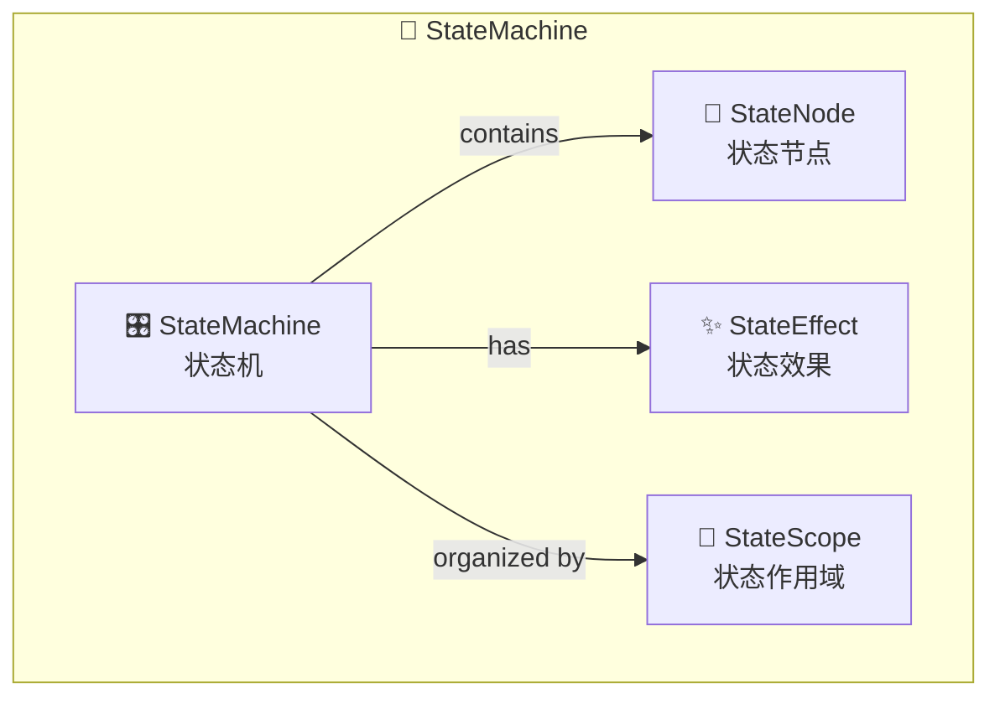
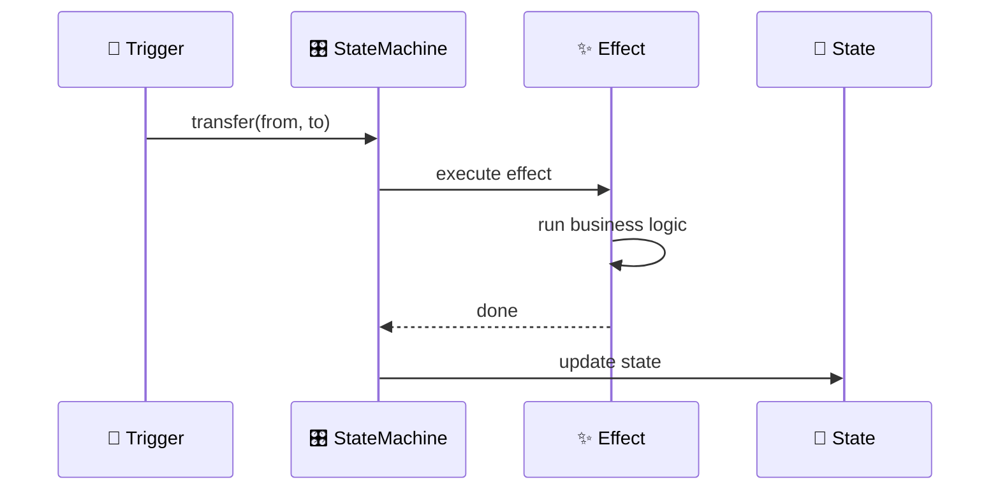
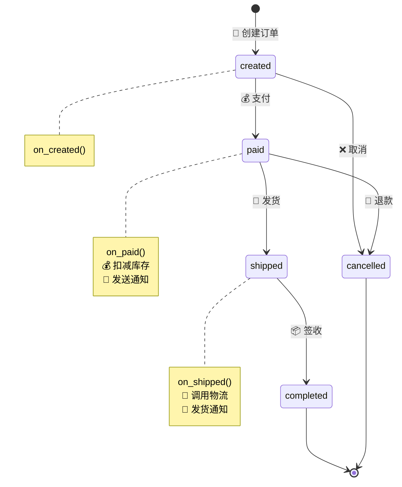
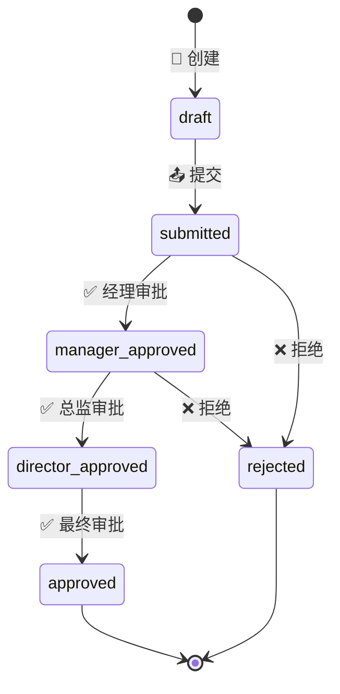
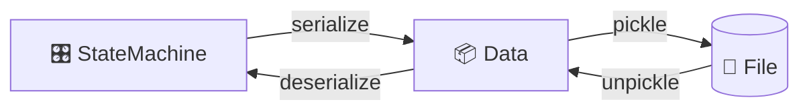

# 🔄 状态机

Zoo Framework 内置了强大的状态机引擎，用于管理复杂的状态转换逻辑。

## 🎯 核心概念



| 🧩 概念 | 📝 说明 |
|---------|---------|
| 🎛️ **StateMachine** | 状态机，管理一组相关状态 |
| 📍 **StateNode** | 状态节点，代表一个具体状态 |
| ✨ **StateEffect** | 状态效果，状态转换时执行的逻辑 |
| 📁 **StateScope** | 状态作用域，状态的组织单元 |

## 📝 基础使用

### 🎛️ 创建状态机

```python
from zoo_framework.statemachine import StateMachineManager

# 🎯 获取状态机管理器
sm_manager = StateMachineManager()

# ➕ 创建状态机
sm_manager.create_state_machine("order")
```

### ➕ 添加状态

```python
# ➕ 添加状态节点
sm_manager.add_state("order", "created")      # 📝 已创建
sm_manager.add_state("order", "paid")         # 💰 已支付
sm_manager.add_state("order", "shipped")      # 🚚 已发货
sm_manager.add_state("order", "completed")    # ✅ 已完成
sm_manager.add_state("order", "cancelled")    # ❌ 已取消
```

### 🔄 状态转换

```python
# 🔄 执行状态转换
sm_manager.transfer("order", "created", "paid")
sm_manager.transfer("order", "paid", "shipped")
sm_manager.transfer("order", "shipped", "completed")
```

### 🔍 查询状态

```python
# 🔍 获取当前状态
current_state = sm_manager.get_current_state("order")
print(f"🔍 当前状态: {current_state}")

# ✅ 检查是否在某个状态
is_paid = sm_manager.is_in_state("order", "paid")

# 📜 获取状态历史
history = sm_manager.get_state_history("order")
```

## ✨ 状态效果

在状态转换时执行自定义逻辑。

### ➕ 添加效果

```python
# 🎯 定义效果函数
def on_order_paid(from_state, to_state, data):
    print(f"💰 订单从 {from_state} 转为 {to_state}")
    print(f"💵 支付金额: {data.get('amount')}")
    # 📧 发送通知
    # 📦 更新库存

# 🔗 注册效果
sm_manager.add_effect("order", "created", "paid", on_order_paid)
```



### ✅ 带条件的状态转换

```python
def can_pay(from_state, to_state, data):
    """
    ✅ 检查是否可以支付
    """
    return data.get('amount', 0) > 0

# ➕ 添加有条件的效果
sm_manager.add_effect(
    "order", 
    "created", 
    "paid", 
    on_order_paid,
    condition=can_pay
)
```

## 💡 完整示例

### 📦 订单状态机

```python
from zoo_framework.workers import BaseWorker
from zoo_framework.statemachine import StateMachineManager
from zoo_framework.utils import LogUtils


class OrderStateMachineWorker(BaseWorker):
    """
    📦 订单状态机 Worker
    """
    
    def __init__(self):
        super().__init__({
            "is_loop": True,
            "delay_time": 1,
            "name": "OrderStateMachineWorker"
        })
        self.setup_state_machine()
    
    def setup_state_machine(self):
        sm = StateMachineManager()
        
        # 🎯 创建状态机
        sm.create_state_machine("order")
        
        # ➕ 添加状态
        states = ["created", "paid", "shipped", "completed", "cancelled"]
        for state in states:
            sm.add_state("order", state)
        
        # 🔗 添加状态效果
        sm.add_effect("order", "created", "paid", self.on_paid)
        sm.add_effect("order", "paid", "shipped", self.on_shipped)
        sm.add_effect("order", "shipped", "completed", self.on_completed)
        sm.add_effect("order", "created", "cancelled", self.on_cancelled)
        sm.add_effect("order", "paid", "cancelled", self.on_cancelled)
    
    def on_paid(self, from_state, to_state, data):
        """
        💰 支付处理
        """
        LogUtils.info(
            f"💰 订单 {data.get('order_id')} 已支付，"
            f"金额: {data.get('amount')}"
        )
        # 📦 扣减库存
        # 📧 发送支付成功通知
        # 📝 创建财务记录
    
    def on_shipped(self, from_state, to_state, data):
        """
        🚚 发货处理
        """
        LogUtils.info(f"🚚 订单 {data.get('order_id')} 已发货")
        # 🚚 调用物流接口
        # 📧 发送发货通知
    
    def on_completed(self, from_state, to_state, data):
        """
        ✅ 完成处理
        """
        LogUtils.info(f"✅ 订单 {data.get('order_id')} 已完成")
        # 📧 发送完成通知
        # 📊 更新统计数据
    
    def on_cancelled(self, from_state, to_state, data):
        """
        ❌ 取消处理
        """
        LogUtils.info(f"❌ 订单 {data.get('order_id')} 已取消")
        # 📦 恢复库存
        # 💰 发起退款
    
    def _execute(self):
        # 🔄 状态机由事件触发，Worker 负责持久化
        pass
```



### 📋 订单服务类

```python
class OrderService:
    """
    📋 订单服务
    """
    
    def __init__(self):
        self.sm = StateMachineManager()
    
    def create_order(self, order_id, amount):
        """
        📝 创建订单
        """
        self.sm.create_state_machine(order_id)
        self.sm.add_state(order_id, "created")
        LogUtils.info(f"📝 创建订单: {order_id}")
    
    def pay_order(self, order_id, amount):
        """
        💰 支付订单
        """
        if self.sm.is_in_state(order_id, "created"):
            self.sm.transfer(order_id, "created", "paid", {
                "order_id": order_id,
                "amount": amount
            })
            return True
        return False
    
    def ship_order(self, order_id, tracking_no):
        """
        🚚 发货
        """
        if self.sm.is_in_state(order_id, "paid"):
            self.sm.transfer(order_id, "paid", "shipped", {
                "order_id": order_id,
                "tracking_no": tracking_no
            })
            return True
        return False
    
    def complete_order(self, order_id):
        """
        ✅ 完成订单
        """
        if self.sm.is_in_state(order_id, "shipped"):
            self.sm.transfer(order_id, "shipped", "completed")
            return True
        return False
    
    def cancel_order(self, order_id):
        """
        ❌ 取消订单
        """
        current = self.sm.get_current_state(order_id)
        if current in ["created", "paid"]:
            self.sm.transfer(order_id, current, "cancelled")
            return True
        return False
```

### 📋 工作流状态机

```python
class WorkflowStateMachineWorker(BaseWorker):
    """
    📋 工作流状态机 - 审批流程
    """
    
    def __init__(self):
        super().__init__({
            "is_loop": True,
            "delay_time": 2,
            "name": "WorkflowStateMachineWorker"
        })
    
    def setup_approval_workflow(self, workflow_id):
        """
        🎯 设置审批工作流
        """
        sm = StateMachineManager()
        sm.create_state_machine(workflow_id)
        
        # 📋 审批状态
        states = [
            "draft",
            "submitted",
            "manager_approved",
            "director_approved",
            "rejected",
            "approved"
        ]
        for state in states:
            sm.add_state(workflow_id, state)
        
        # 🔗 审批流程
        sm.add_effect(workflow_id, "draft", "submitted", self.on_submitted)
        sm.add_effect(workflow_id, "submitted", "manager_approved", self.on_manager_approve)
        sm.add_effect(workflow_id, "manager_approved", "director_approved", self.on_director_approve)
        sm.add_effect(workflow_id, "director_approved", "approved", self.on_final_approve)
        sm.add_effect(workflow_id, "submitted", "rejected", self.on_rejected)
        sm.add_effect(workflow_id, "manager_approved", "rejected", self.on_rejected)
    
    def on_submitted(self, from_state, to_state, data):
        LogUtils.info(f"📤 审批申请已提交: {data.get('applicant')}")
        # 📧 通知经理
    
    def on_manager_approve(self, from_state, to_state, data):
        LogUtils.info("✅ 经理审批通过")
        # 📧 通知总监
    
    def on_director_approve(self, from_state, to_state, data):
        LogUtils.info("✅ 总监审批通过")
    
    def on_final_approve(self, from_state, to_state, data):
        LogUtils.info("🎉 审批完成")
        # 📧 通知申请人
    
    def on_rejected(self, from_state, to_state, data):
        LogUtils.info(f"❌ 审批被拒绝: {data.get('reason')}")
        # 📧 通知申请人
```



## 💾 状态持久化

状态机支持持久化，确保状态不丢失。

### 🔄 自动持久化

StateMachineWorker 会自动持久化状态：

```python
from zoo_framework.workers import StateMachineWorker

class MyStateWorker(StateMachineWorker):
    def __init__(self):
        super().__init__()
        # 💾 自动启用持久化
```

### 📝 手动持久化

```python
from zoo_framework.utils import FileUtils
import pickle

class StatePersistence:
    """
    💾 状态持久化工具
    """
    
    @staticmethod
    def save(sm_manager, filepath):
        """
        💾 保存状态机
        """
        data = sm_manager.serialize()
        with open(filepath, 'wb') as f:
            pickle.dump(data, f)
    
    @staticmethod
    def load(filepath):
        """
        📂 加载状态机
        """
        if FileUtils.file_exists(filepath):
            with open(filepath, 'rb') as f:
                data = pickle.load(f)
            sm_manager = StateMachineManager()
            sm_manager.deserialize(data)
            return sm_manager
        return None
```



## ✅ 最佳实践

### 1️⃣ 状态命名规范

```python
# ✅ 使用小写+下划线
"pending_approval"    # ⏳ 待审批
"in_progress"         # 🔄 进行中
"completed"           # ✅ 已完成
"failed"              # ❌ 失败
"cancelled"           # 🚫 已取消
```

### 2️⃣ 状态机粒度

```python
# ✅ 好的实践：一个业务一个状态机
sm_manager.create_state_machine("order_12345")
sm_manager.create_state_machine("payment_67890")

# ❌ 避免：过大的状态机
sm_manager.create_state_machine("all_orders")  # 不推荐
```

```mermaid
graph TB
    subgraph ✅ Good Practice
        G1[🎛️ order_001]
        G2[🎛️ order_002]
        G3[🎛️ payment_001]
    end
    
    subgraph ❌ Bad Practice
        B1[🎛️ all_orders<br/>太大难以维护]
    end
```

### 3️⃣ 异常处理

```python
def on_state_change(self, from_state, to_state, data):
    try:
        # 🔄 状态转换逻辑
        self.process_data(data)
    except Exception as e:
        LogUtils.error(f"❌ 状态转换失败: {e}")
        # 🔄 回滚或补偿操作
        self.compensate(from_state, data)
```

### 4️⃣ 状态校验

```python
def transfer_with_validation(self, sm_id, from_state, to_state, data):
    sm = StateMachineManager()
    
    # ✅ 检查当前状态
    current = sm.get_current_state(sm_id)
    if current != from_state:
        raise ValueError(
            f"❌ 当前状态 {current} 不是期望的 {from_state}"
        )
    
    # ✅ 检查转换是否允许
    allowed = self.get_allowed_transitions(sm_id, current)
    if to_state not in allowed:
        raise ValueError(
            f"❌ 不允许从 {current} 转换到 {to_state}"
        )
    
    # 🔄 执行转换
    sm.transfer(sm_id, from_state, to_state, data)
```

## 📊 状态机与其他组件集成

```mermaid
graph TB
    subgraph 🎯 Components
        W[👷 Worker]
        E[📬 Event]
        SM[🔄 StateMachine]
        P[💾 Persistence]
    end
    
    W -->|trigger| E
    E -->|transfer| SM
    SM -->|callback| W
    SM -.->|save| P
    P -.->|load| SM
```
