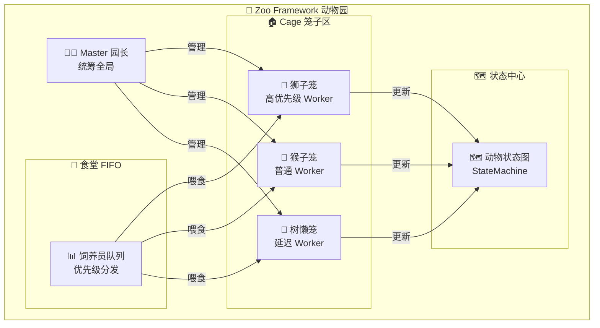
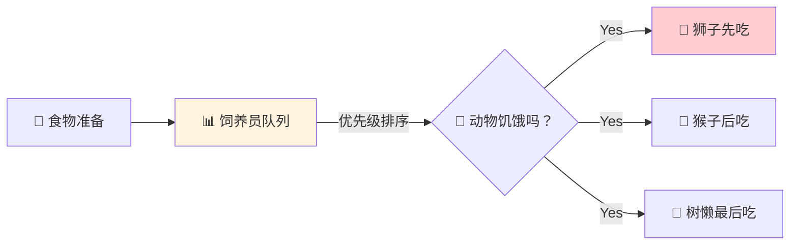
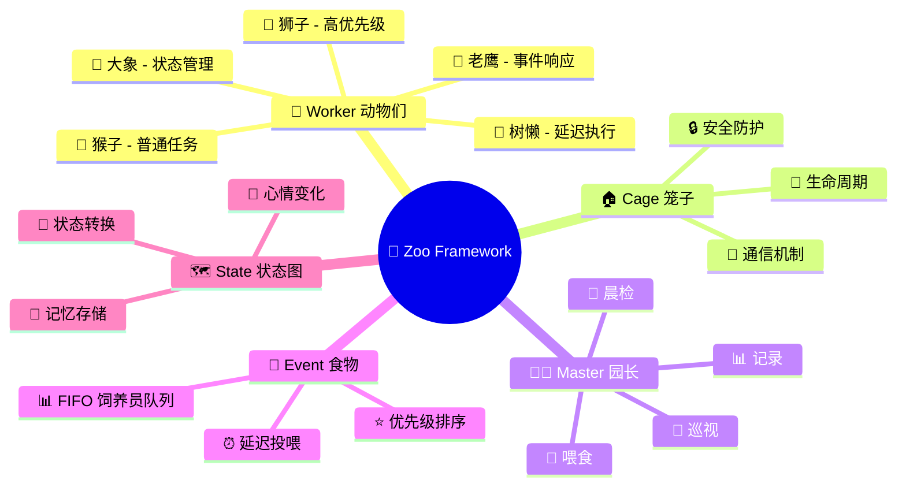

## 🎪 动物园理念

> **Zoo Framework** 的设计理念来自真实的动物园管理系统：



### 🦁 Worker = 动物

每只 **Worker** 都是动物园里独特的动物：

| 🦁 动物 | 📝 Worker 类型 | ⚡ 特点 |
|---------|---------------|---------|
| 🦁 狮子 | 高优先级 Worker | 凶猛、优先获得资源 |
| 🐒 猴子 | 普通 Worker | 灵活、好动、循环执行 |
| 🦥 树懒 | 延迟 Worker | 慢吞吞、定时执行 |
| 🦅 老鹰 | 事件 Worker | 敏锐、响应事件 |
| 🐘 大象 | 状态机 Worker | 稳重、管理复杂状态 |

```python
# 🦁 创建一只狮子 Worker（高优先级）
from zoo_framework.workers import BaseWorker

class LionWorker(BaseWorker):  # 🦁 狮子
    def __init__(self):
        super().__init__({
            "name": "🦁 LionKing",      # 狮子王
            "delay_time": 1,             # 每秒巡视一次
            "priority": 100              # 🔴 最高优先级
        })
    
    def _execute(self):
        print("🦁 吼！我是森林之王，优先处理重要任务！")
```

### 🏠 Cage = 笼子

**Cage**（笼子）是动物们的家：

- 🔒 **安全防护** - 防止动物乱跑（线程安全）
- 🔄 **统一管理** - 管理动物的作息（生命周期）
- 📢 **互相通信** - 笼子之间的传声筒（事件通信）
- 📊 **状态监控** - 记录动物的健康状态（监控）

```python
from zoo_framework.core.aop import Cage

@cage.protect  # 🏠 把 Worker 放进笼子保护
class ProtectedWorker(BaseWorker):
    """
    🐒 受保护的猴子 Worker
    运行在 Cage（笼子）里，安全又舒适
    """
    def _execute(self):
        print("🐒 我在笼子里安全地玩耍！")
```

### 🎪 Master = 园长

**Master** 是动物园园长：

```
👨‍💼 Master 园长的一天：
├── 🌅 早上 - 检查所有动物（Worker）状态
├── 🍖 上午 - 分发食物（Event）给饥饿的动物
├── 🔄 下午 - 巡视笼子（Cage），确保运转正常
├── 📊 晚上 - 记录动物状态（StateMachine）
└── 🌙 深夜 - 保存数据，休息
```

```python
from zoo_framework.core import Master

# 👨‍💼 创建园长
master = Master()

# 🎪 开园！所有动物开始工作
master.run()
```

### 🍖 Event = 食物

**Event**（事件）是动物们的食物：



```python
from zoo_framework.fifo.node import EventNode

# 🍖 准备食物（事件）
food = EventNode(
    topic="lunch.meat",           # 🥩 午餐肉
    content={"type": "beef"},      # 牛肉
    priority=100                   # 🔴 高优先级食物
)

# 📤 放入饲养员队列
EventChannelManager.get_channel("zoo").push(food)
```

## 🚀 快速入园

### 🎫 买票（安装）

::: code-group

```bash [pip]
pip install zoo-framework
```

```bash [uv]
uv pip install zoo-framework
```

:::

### 🏗️ 搭建动物园（创建项目）

```bash
# 🏗️ 创建动物园
zfc --create my_zoo
cd my_zoo

# 🦁 添加动物
zfc --worker lion
zfc --worker monkey
zfc --worker sloth
```

### 🦁 养一只狮子

```python
# workers/lion_worker.py
from zoo_framework.workers import BaseWorker

class LionWorker(BaseWorker):  # 🦁 狮子
    def __init__(self):
        super().__init__({
            "name": "🦁 LionKing",
            "is_loop": True,
            "delay_time": 2  # ⏱️ 每2秒巡视一次领地
        })
    
    def _execute(self):
        print("🦁 吼！我是狮子王，正在处理高优先级任务！")
```

### 🎪 开园

```python
# main.py
from zoo_framework.core import Master

if __name__ == "__main__":
    print("🎪 动物园开园啦！")
    master = Master()
    master.run()  # 🎉 所有动物开始工作
```

输出：
```
🎪 动物园开园啦！
🦁 吼！我是狮子王，正在处理高优先级任务！
🦁 吼！我是狮子王，正在处理高优先级任务！
```

## 🗺️ 动物园地图



## 📚 游览指南

### 🔰 新手入园
- [🎫 入园指南](/start/) - 5分钟成为合格饲养员
- [🏗️ 搭建笼子](/start/new.html) - 创建你的第一个动物园
- [🗺️ 动物园布局](/guide/structure.html) - 了解动物园结构

### 🦁 认识动物
- [🦁 Worker 动物们](/core/worker.html) - 了解各种动物的特点
- [🍖 Event 食物系统](/core/event.html) - 如何喂养动物
- [🗺️ 状态图](/core/statemachine.html) - 动物的心情变化
- [📊 FIFO 饲养员队列](/core/fifo.html) - 食物分发机制
- [🏠 Cage 笼子](/core/waiter.html) - 动物的家

### 🎪 高级驯兽
- [✂️ AOP 驯兽技巧](/advanced/aop.html)
- [⚡ Reactor 反应训练](/advanced/reactor.html)
- [🔒 Cage 安全加固](/advanced/lock.html)
- [🔌 引入新物种](/advanced/plugin.html)

## 🌟 为什么选择 Zoo Framework？

### 🎪 有趣的编程体验

传统多线程：枯燥的 Thread 管理  
**Zoo Framework**：有趣的动物园管理 🎪

```python
# ❌ 传统方式：枯燥
import threading
t = threading.Thread(target=func)
t.start()

# ✅ Zoo Framework：有趣！
class LionWorker(BaseWorker):  # 🦁 我是狮子！
    def _execute(self):
        print("吼！")
```

### 🧠 易理解的设计

| 🎪 动物园概念 | 💻 编程概念 |
|--------------|------------|
| 🦁 动物 | Worker 工作器 |
| 🏠 笼子 | Cage 线程管理 |
| 👨‍💼 园长 | Master 调度器 |
| 🍖 食物 | Event 事件 |
| 📊 饲养员 | FIFO 队列 |
| 🗺️ 状态图 | StateMachine |

### 🛡️ 安全可靠

- 🔒 Cage 笼子保护线程安全
- 👨‍💼 Master 园长监控全局
- 📊 完善的日志和监控

## 🤝 成为饲养员

欢迎加入 Zoo Framework 动物园！

[GitHub](https://github.com/YearsAlso/zoo-framework) | [Issues](https://github.com/YearsAlso/zoo-framework/issues) | [文档](https://github.com/YearsAlso/zoo-framework-doc)

---

<p align="center">
  🎪 Made with ❤️ by Zoo Framework Team 🦁
</p>
