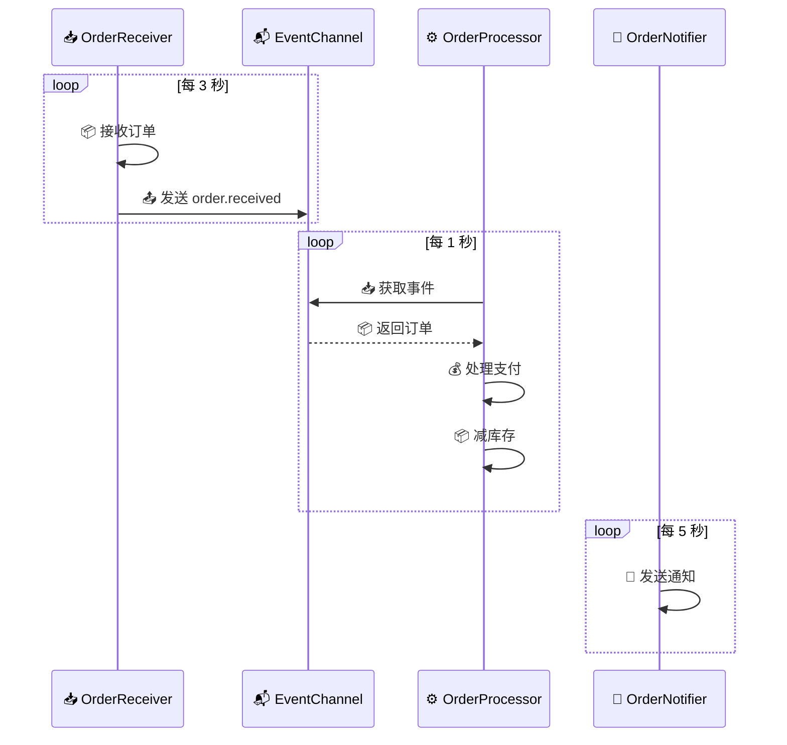

# 🆕 新建项目

## 🛠️ 使用 zfc 命令行工具

Zoo Framework 提供了 `zfc` 命令行工具来快速创建项目结构。

## 📁 创建项目

```bash
zfc --create <project_name>
```

示例：

```bash
zfc --create ecommerce_system
```

## 🗂️ 项目结构

创建后的项目结构如下：

```
ecommerce_system/
├── 📄 config.json              # 🔧 主配置文件
├── 📁 src/                     # 💻 源代码目录
│   ├── 🚀 main.py             # 🎯 应用入口
│   ├── 👷 workers/            # 👷 Worker 目录
│   │   ├── __init__.py
│   │   └── *.py
│   ├── 📬 events/             # 📬 事件定义目录
│   │   ├── __init__.py
│   │   └── *.py
│   ├── ⚙️ conf/               # ⚙️ 配置类目录
│   │   ├── __init__.py
│   │   └── *.py
│   └── 📋 params/             # 📋 参数类目录
│       ├── __init__.py
│       └── *.py
└── 📁 logs/                   # 📝 日志目录
```

### 📄 config.json

```json
{
  "_exports": [],
  "📝 log": {
    "📁 path": "./logs",
    "📊 level": "debug"
  },
  "👷 worker": {
    "🎛️ runPolicy": "simple",
    "🏊 pool": {
      "🔢 size": 5,
      "✅ enabled": false
    }
  }
}
```

配置项说明：

| 🔧 配置项 | 📋 类型 | 📝 说明 | 🔢 默认值 |
|-----------|---------|---------|-----------|
| `log.path` | 📁 string | 日志文件存储路径 | `./logs` |
| `log.level` | 📊 string | 日志级别 | `info` |
| `worker.runPolicy` | 🎛️ string | Worker 运行策略 | `simple` |
| `worker.pool.enabled` | ✅ boolean | 是否启用线程池 | `false` |
| `worker.pool.size` | 🔢 integer | 线程池大小 | `5` |

## 👷 创建 Worker

```bash
zfc --worker <worker_name>
```

示例：

```bash
zfc --worker order_processor
```

这会在 `src/workers/` 目录下创建 `order_processor_worker.py`：

```python
from zoo_framework.workers.base_worker import BaseWorker


class OrderProcessorWorker(BaseWorker):
    def __init__(self):
        BaseWorker.__init__(self, {
            "is_loop": True,
            "delay_time": 5,
            "name": "OrderProcessorWorker"
        })

    def _destroy(self, result):
        pass

    def _execute(self):
        # 📝 编写业务逻辑
        pass
```

同时在 `src/workers/__init__.py` 中自动注册：

```python
from .order_processor_worker import OrderProcessorWorker
```

## 📊 项目架构图

```mermaid
graph TB
    subgraph "📁 Project Root"
        C[📄 config.json]
    end
    
    subgraph "📁 src/"
        M[🚀 main.py]
        
        subgraph 👷 workers/
            W1[order_worker.py]
            W2[payment_worker.py]
            WI[__init__.py]
        end
        
        subgraph 📬 events/
            E1[event_definitions.py]
            EI[__init__.py]
        end
        
        subgraph ⚙️ conf/
            CF1[app_config.py]
            CFI[__init__.py]
        end
        
        subgraph 📋 params/
            P1[worker_params.py]
            PI[__init__.py]
        end
    end
    
    subgraph 📁 logs/
        L1[app.log]
    end
    
    C --> M
    M --> W1
    M --> W2
    WI --> W1
    WI --> W2
    M --> E1
    M --> CF1
    M --> P1
    W1 --> L1
    W2 --> L1
```

## 💼 完整示例

### 1️⃣ 创建项目

```bash
zfc --create order_system
cd order_system
```

### 2️⃣ 创建多个 Worker

```bash
zfc --worker order_receiver
zfc --worker order_processor
zfc --worker order_notifier
```

### 3️⃣ 编写业务代码

📄 `src/workers/order_receiver_worker.py`:

```python
from zoo_framework.workers import BaseWorker
from zoo_framework.utils import LogUtils
from zoo_framework.event import EventChannelManager
from zoo_framework.fifo.node import EventNode


class OrderReceiverWorker(BaseWorker):
    """
    📥 订单接收 Worker - 接收并分发订单
    """
    
    def __init__(self):
        super().__init__({
            "is_loop": True,
            "delay_time": 3,  # ⏱️ 每 3 秒检查一次
            "name": "OrderReceiverWorker"
        })
    
    def _execute(self):
        # 📦 模拟接收订单
        order = {"order_id": f"ORD-{time.time()}", "amount": 199.99}
        LogUtils.info(f"📥 接收订单: {order['order_id']}")
        
        # 📤 发送订单事件
        node = EventNode(
            topic="order.received",
            content=order,
            priority=50
        )
        EventChannelManager.get_channel("order").push(node)
```

📄 `src/workers/order_processor_worker.py`:

```python
from zoo_framework.workers import BaseWorker
from zoo_framework.utils import LogUtils
from zoo_framework.event import EventChannelManager


class OrderProcessorWorker(BaseWorker):
    """
    ⚙️ 订单处理 Worker - 处理订单业务
    """
    
    def __init__(self):
        super().__init__({
            "is_loop": True,
            "delay_time": 1,  # ⏱️ 每秒处理一次
            "name": "OrderProcessorWorker"
        })
    
    def _execute(self):
        # 📥 从事件通道获取订单
        channel = EventChannelManager.get_channel("order")
        node = channel.pop()
        
        if node and node.topic == "order.received":
            LogUtils.info(f"⚙️ 处理订单: {node.content['order_id']}")
            # 💰 扣款、减库存等业务逻辑...
            self.process_payment(node.content)
```

📄 `src/workers/order_notifier_worker.py`:

```python
from zoo_framework.workers import BaseWorker
from zoo_framework.utils import LogUtils


class OrderNotifierWorker(BaseWorker):
    """
    📧 订单通知 Worker - 发送订单通知
    """
    
    def __init__(self):
        super().__init__({
            "is_loop": True,
            "delay_time": 5,
            "name": "OrderNotifierWorker"
        })
    
    def _execute(self):
        # 📧 发送邮件/短信通知
        LogUtils.info("📧 发送订单通知")
```

### 4️⃣ 配置 config.json

```json
{
  "_exports": [],
  "📝 log": {
    "📁 path": "./logs",
    "📊 level": "info"
  },
  "👷 worker": {
    "🎛️ runPolicy": "stable",
    "🏊 pool": {
      "🔢 size": 10,
      "✅ enabled": true
    }
  }
}
```

### 5️⃣ 启动应用

📄 `src/main.py`:

```python
from zoo_framework.core import Master

if __name__ == "__main__":
    # 🎯 创建 Master 实例
    master = Master()
    
    # 🚀 启动应用
    master.run()
```

运行：

```bash
cd src
python main.py
```

## 🔄 数据流向图



## 🎯 配置最佳实践

### 📝 日志级别

| 📊 级别 | 📝 使用场景 |
|---------|-------------|
| `debug` | 🐛 开发调试 |
| `info` | 📋 生产环境 |
| `warning` | ⚠️ 警告信息 |
| `error` | ❌ 错误信息 |

### 🎛️ 运行策略

| 🎛️ 策略 | 📝 适用场景 | ⚡ 特点 |
|----------|-------------|---------|
| `simple` | 🚀 简单应用 | 单线程顺序执行 |
| `stable` | 🛡️ 生产环境 | 异常自动恢复 |
| `safe` | 🔒 高并发 | 线程隔离 |

### 🏊 线程池配置

```json
{
  "👷 worker": {
    "🏊 pool": {
      "✅ enabled": true,
      "🔢 size": 10
    }
  }
}
```

- 🔢 `size`: 根据 CPU 核心数设置，通常为 `CPU核心数 * 2`
- ✅ `enabled`: CPU 密集型任务建议开启

## ❓ 常见问题

### Q: 如何创建多个相同类型的 Worker？

A: 创建不同的类：

```python
class OrderProcessorWorker1(BaseWorker):
    def __init__(self):
        super().__init__({"name": "OrderProcessor1"})

class OrderProcessorWorker2(BaseWorker):
    def __init__(self):
        super().__init__({"name": "OrderProcessor2"})
```

### Q: Worker 之间如何通信？

A: 使用事件系统：

```python
# Worker A 发送
EventChannelManager.get_channel("channel_name").push(node)

# Worker B 接收
node = EventChannelManager.get_channel("channel_name").pop()
```

### Q: 如何配置不同环境的配置文件？

A: 使用环境变量：

```python
import os

config_file = os.getenv("ZOO_CONFIG", "config.json")
ParamsFactory(config_file)
```

## 📚 下一步

- [👷 深入了解 Worker →](/core/worker.html)
- [📬 学习事件系统 →](/core/event.html)
- [🔄 掌握状态机 →](/core/statemachine.html)
